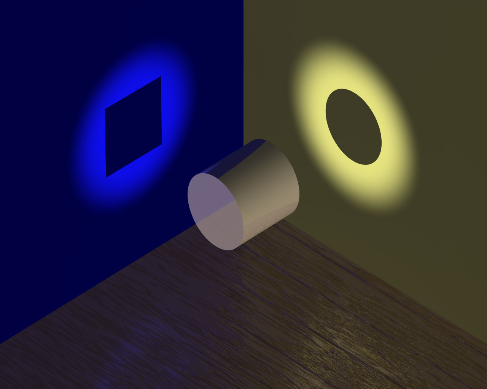
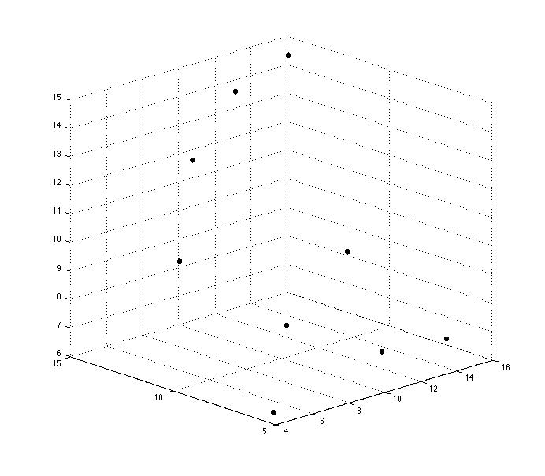
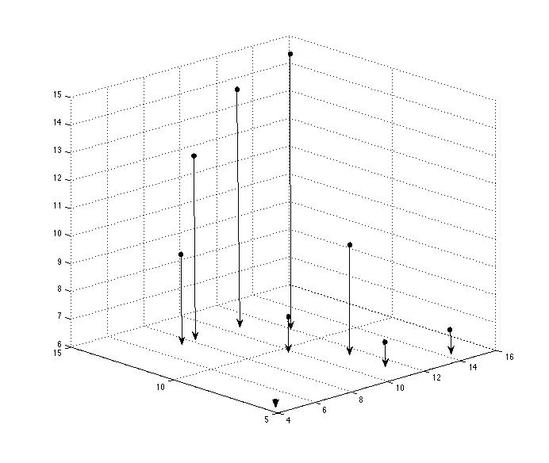
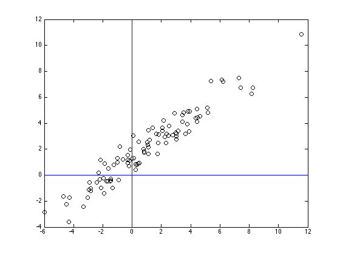
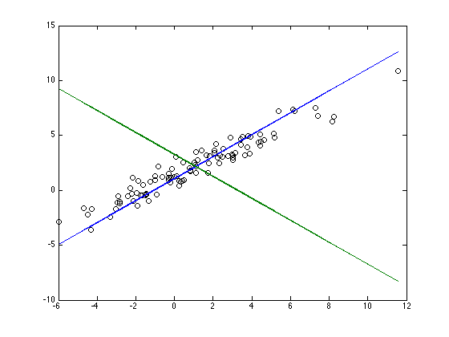
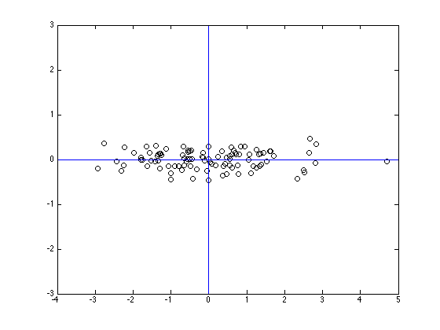
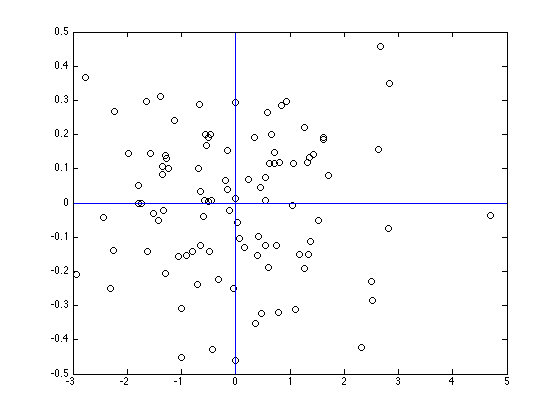
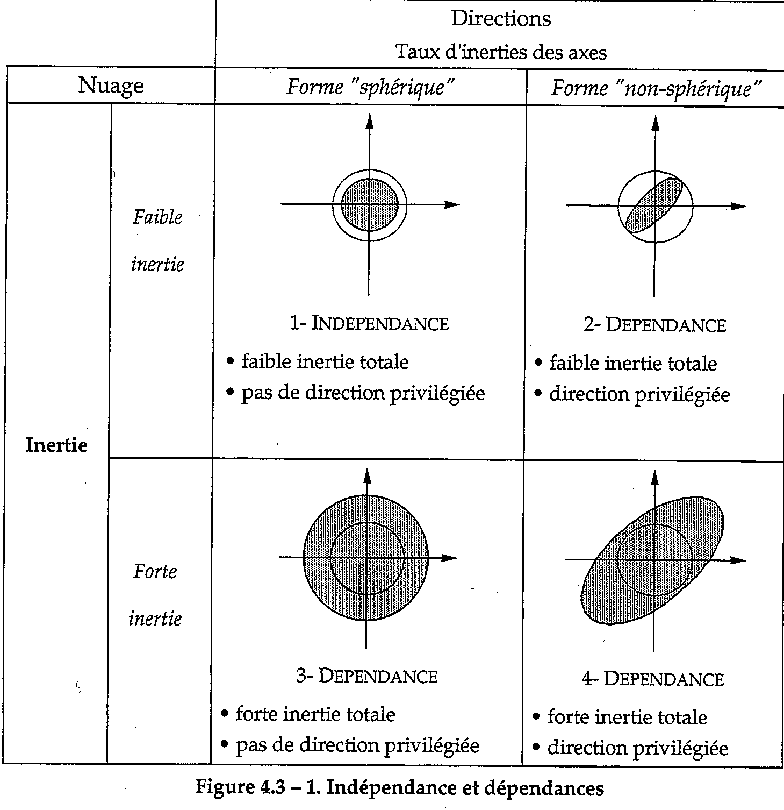
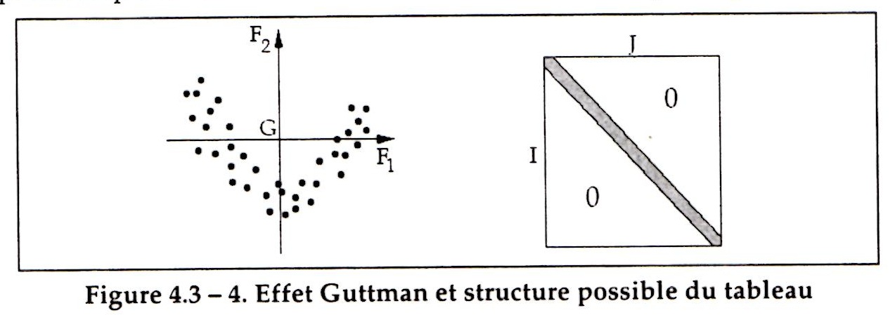

```{r setup, include=FALSE}
knitr::opts_chunk$set(echo = TRUE, comment = "", fig.align = "center")
```

## Présentation

### Organisation du module de Statistique Exploratoire

* **Deux sessions** :
    + Analyse exploratoire des données multidimensionnelles (9 et 10 Mars)
    + Classification automatique ( et  Mars)
    
* **Cinq intervenants** :
    + FX Jollois (à la place de Servane Gey - 9 Mars) et Charles Bouveyron ( Mars) : introduction aux méthodologies
    + Antoine-Eric Sammartino (10 Mars), Rachel Verjus et Taoufik En-Najjary ( Mars) : application sur données réelles
    
* **Evaluation orale individuelle** à la fin de chaque session (10 et  Mars)

* **Validation du module** : moyenne des deux évaluations $\geqslant 10$

### Coordonnées et références

* **Deux intervenants** :
    + FX Jollois (à la place de Servane Gey - 9 Mars) francois-xavier.jollois@parisdescartes.fr | Servane.Gey@parisdescartes.fr
    + Antoine-Eric Sammartino (10 Mars) antoine-eric.sammartino@laposte.net
    
* **Références** (liste non-exhaustive) :
    + Analyse de Données avec R, *F. Husson, S. Lê, J. Pagès*, Presses Universitaires de Rennes.
    + Statistique Exploratoire Multidimensionnelle, *L. Lebart, M. Piron, A. Morineau*, DUNOD.
    + Package R FactoMineR : http://factominer.free.fr/
    + MOOC Analyse des Données Multidimensionnelles, *F. Husson*, sur plateforme FUN.
    + Multidimensional Scaling, second edition, *T.F. Cox, M. A. A. Cox*, Chapman & Hall.
    + An Introduction to MDS, *F. Wickelmaier* : https://homepage.uni-tuebingen.de/florian.wickelmaier/pubs/Wickelmaier2003SQRU.pdf

### Planning de la journée

1. **Tables de données**
    + Données brutes, tableaux disjonctifs complets
    + Tableaux de contingences, tables de Burt 
    
2. **Analyse en Composantes Principales (ACP)**
    + Facteurs et Composantes principales
    + Valeurs propres et axes factoriels
    + Représentations graphiques  
    
3. **Analyse Factorielle des Correspondances Simples (AFC) et Multiples (ACM)**
    + AFC sur tableau de contingence
    + ACM sur tableau disjonctif complet ou table de Burt
    + Représentations graphiques   
    
4. **Positionnement Multidimensionnel (MDS)**

## Tables de Données

### Données brutes

Recensement aux Etats-Unis en 2012 ([données](donnees/Recensement_12.csv))

```{r}
x = read.csv2("donnees/Recensement_12.csv", row.names = 1)
head(x, 10)
```

```{r}
str(x)
```

### Traitement univarié des données brutes

```{r}
summary(x)
```


```{r}
par(mfrow=c(2,2), mar = c(2, 2, 4, 0) + .1)
pie(table(x$SEXE), radius = 1, init.angle = 90,
    col = c("lightgreen","orange"), main = "Sexe")
hist(x$SAL_HOR, 
     main = "Salaire horaire", col = "gray80",
     xlab = "", ylab = "")
p = 100*prop.table(table(x$NB_ENF))
barplot(p, main = "Nombre d'enfants au foyer")
p4 = 100*prop.table(table(x$REV_FOYER))
barplot(p4[c(1,3,4,2)], main = "Revenus du foyer")
```

### Traitement multivarié : variables quantitatives

Liens entre variables quantitatives : 

- covariance et corrélation.
- Traduit la force du lien linéaire entre 2 variable numériques $X$ et $Y$ :

$$Cov(X,Y)=\frac{1}{n}\sum_{i=1}^n(x_i-\bar{x})(y_i-\bar{y}),$$


$$Cor(X,Y)=\frac{Cov(X.Y)}{\sigma_X \sigma_Y}\in [-1,1]$$ 

où $\bar{\bullet}$ représente la moyenne et $\sigma_{\bullet}$ l'écart-type. 

Plus $Cor(X,Y)$ est proche de -1 ou 1, et plus les données sont distribuées suivant une droite. Le signe de $Cor(X,Y)$ traduit une relation croissante (corrélation positive), ou décroissante (corrélation négative).

$X=(x_i^{(j)})$ tableau (ou matrice) de données numériques brutes à $n$ lignes (individus) et p colonnes (variables).

$\Sigma$ matrice des 

- variances/covariances : $\Sigma_{k,j}=Cov(X^{(k)},X^{(j)})$
- corrélations : $\Sigma_{k,j}=Cor(X^{(k)},X^{(j)})$

$\Sigma$ matrice $p\times p$ symétrique (définie positive)

*Remarque* : 
$$Cov(X^{k},X^{(k)})=\sigma_{X^{(k)}}^2, \ \ Cor(X^{k},X^{(k)})=\frac{\sigma_{X^{(k)}}^2}{\sigma_{X^{(k)}}^2}=1.$$

Lecture simultanée 

+ des variances (diagonale variances/covariances)
+ des liens entre les variables (hors diagonale corrélations) 
    
Traduit les liens des variables 2 à 2.

```{r}
quanti = c(1,5,9,10)
round(cov(x[,quanti], use = "complete.obs"), digits=2)
round(cov(x[,quanti], use = "pairwise.complete.obs"), digits=2)
round(cor(x[,quanti], use = "complete.obs"), digits=2)
round(cor(x[,quanti], use = "pairwise.complete.obs"), digits=2)
```

```{r}
pairs(x[,quanti])
```

### Traitement multivarié : variables qualitatives 

#### Données brutes 

Tableau disjonctif complet = recodage des variables qualitatives en autant de variables binaires qu'il y a de modalités.

```{r, echo = FALSE}
x1 = x[,c(2, 3, 11)]
head(x1, 10)
```

```{r, echo = FALSE}
disj <- function(f) {
    res = sapply(levels(x1[,f]), function(l) return (x1[,f] == l)) * 1
    colnames(res) = paste(f, colnames(res), sep = ":")
    res
}
z1 = cbind(disj("SEXE"), disj("REGION"), disj("REV_FOYER"))
head(z1, 10)
```

#### Données groupées bivariées 

Tableau de contingence = distribution jointe des deux variables qualitatives $X$ et $Y$.

```{r}
table(x$SEXE,x$REV_FOYER)
```

Profils lignes = distributions de la variable colonne $Y$ conditionnellement aux modalités de la variable ligne $X$.

```{r}
100 * prop.table(table(x$SEXE,x$REV_FOYER), margin = 1)
```

Profils colonnes = distributions de la variable ligne $X$ conditionnellement aux modalités de la variable colonne $Y$.

```{r}
100 * prop.table(table(x$SEXE,x$REV_FOYER), margin = 2)
```

- Test du $\chi^2$ d'indépendance pour 2 variables qualitatives : permet de tester si deux variables qualitatives $X$ et $Y$ influent l'une sur l'autre. 
- **Statistique** $T$ du $\chi^2$ d'indépendance : traduit la distance des profils lignes (resp. colonnes) à la distribution marginale de la variable colonne $Y$ (resp. ligne $X$). 
- $X$ et $Y$ sont **indépendantes** si et seulement si tous les profils lignes (resp. colonnes) sont égaux à la distribution marginale correspondante.
- $\Longrightarrow$ Si $X$ et $Y$ sont indépendantes, $T$ est proche de $0$.
- Si $T$ est grande, on rejette l'hypothèse d'indépendance entre $X$ et $Y$. 
- Le test est dit **significatif** si sa p-valeur est $<$ au seuil fixé $\alpha$ (en général $\alpha=5\%$). Dans ce cas, on rejette l'hypothèse d'indépendance entre $X$ et $Y$.

```{r}
summary(table(x$SEXE,x$REV_FOYER))
```

### Traitement multivarié : variables qualitatives (LPM)

Données groupées multivariées : Table de Burt. 

Utile lorsqu'il s'agit de stocker une base de données (enquête, etc...) composée d'un grand nombre d'individus.

```{r, echo = FALSE}
z1.comp = z1
z1.comp[is.na(z1.comp)] = 0
b1 = t(z1.comp) %*% z1.comp
b1
```


## Analyse en Composantes Principales (ACP)

### Objectifs de l'ACP

- Méthode descriptive pour l'analyse multivariée de variables **quantitatives**.
- Permet de représenter des données de grande taille pour :
    + la visualisation $\longrightarrow$ description résumée 
        + des individus (détection d'individus ou groupes d'individus atypiques),
        + des variables (liaisons et sélection).
    + la compression $\longrightarrow$ réduction du nombre de variables,
    + le débruitage $\longrightarrow$ réduction de la variabilité.
- **Citation** (*Lebart, Piron, Morineau*, Chapitre 1)  

> "Nous cherchons en fait une technique de réduction s'appliquant de façon systématique à divers types de tableaux et conduisant à une reconstitution rapide mais approximative du tableau de départ."

### Cadre

- $X=(x_i^{(j)})$ tableau (ou matrice) de données numériques brutes à $n$ lignes (individus) et p colonnes (variables).
- Individu $i$ assimilé à un point de $\mathbb{R}^p$ de coordonnées $(x_i^{(1)},\ldots,x_i^{(p)})$ (lecture du tableau en lignes).
- Variable $j$ assimilée à point de $\mathbb{R}^n$ de coordonnées $(x_1^{(j)},\ldots,x_n^{(j)})$ (lecture du tableau en colonnes).

```{r}
head(iris[,-5])
```

### Exemple dans $\mathbb{R}^3$ : Représentation d'un cylindre



### Exemple 1 : Représentation dans un plan

Le point de vue adopté par le photographe rend-il convenablement la forme du nuage dans l'espace ?


HLP (Husson F., Lê S., Pagès J.)

### Exemple 2 : Nuage de points dans $\mathbb{R}^3$

Forme difficilement visible dans $\mathbb{R}^3$



#### Projections du nuage

Projections du nuage sur les axes de coordonnées $\Longrightarrow$ 3 nuages de points dans $\mathbb{R}^2$



### Exemple 3 : Scatterplot sur les iris de Fisher

```{r}
plot(iris[,-5])
```

### Objectifs et outils

1. **Objectifs**
    + Etudier les individus du point de vue de **l'ensemble des variables**.
    + Trouver le(s) meilleur(s) plan(s) afin de rendre compte **au mieux** de la forme du nuage de points.
    + **Projection** du nuage de points dans $\mathbb{R}^p$ sur des sous-espaces de dimensions $q<<p$. 

2. **Outils**
    + Sous-espaces de dimensions $q<<p$ construits sur les données de manière à conserver **au mieux** la forme du nuage dans $\mathbb{R}^p$.
    + Construction de **nouvelles variables** (=facteurs) concentrant la variance du nuage de points en un petit nombre $q$ de facteurs.
    + **Représentation graphique** des individus dans des plans minimisant les déformations du nuage de points.
    + **Représentation graphique** des variables dans des plans explicitant les liaisons initiales entre ces variables.
    + **Réduction de la dimension** (=compression) : approximation du tableau de données initial $n\times p$ par un tableau $n\times q$.

### Principe et définitions

Changement de repère dans $\mathbb{R}^p$ (individus), ou $\mathbb{R}^n$ (variables), de manière à **concentrer la variabilité** du nuage de points sur les premiers facteurs.

Facteurs principaux $(F^{(k)})_{1\leq k\leq q}$ : 

- combinaisons linéaires des variables initiales $$F^{(k)} = a_{k,0}+\sum_{j=1}^pa_{k,j}X^{(j)},$$
- 2 à 2 non-corrélées : $\forall k \neq k' \ \ \ Cor(F^{(k)},F^{(k')})=0$.

Composantes principales $(c^{(1)},\ldots,c^{(q)})$ : 

- mesures des individus sur les nouvelles variables $(F^{(1)},\ldots, F^{(q)})$ 
$$ \forall i\in \{1,\ldots, n\} \ k\in \{1,\ldots,q\} \ \ \ c^{(k)}_i= a_{k,0}+\sum_{j=1}^pa_{k,j}x_i^{(j)},$$
- centrées $\overline{c^{(k)}}=0$.

### Repère Factoriel dans $\mathbb{R}^p$

- Construction d'un nouveau repère de $\mathbb{R}^p$ 
    + d'**origine** $g=(\overline{x}^{(1)},\ldots, \overline{x}^{(p)})$,
    + d'axes définis par les **facteurs** $(F^{(k)})_{1\leq k\leq p}$,
    + concentrant la variance du nuage de points sur les premiers axes,
    + minimisant les déformations du nuage de points sur les premiers axes.

- Construction basée sur la **diagonalisation** de la matrice des 
    - variances/covariances (ACP non-normée)
    - corrélations (ACP normée).

- Part de variance expliquée par chaque facteur donnée par les **valeurs propres** de la matrice.

- Nouveau repère défini par les **vecteurs propres** de la matrice, engendrant les facteurs.

### Exemple en 2D

#### Repère $(0,X^{(1)},X^{(2)})$



#### Repère factoriel $(g,F^{(1)},F^{(2)})$ : axe 1 associé à la plus grande valeur propre, axe 2 associé à la plus petite. 



#### Rotation du repère...



#### ... et changement d'échelle.




### Construction du repère factoriel

- $\Sigma$ : matrice des variances/covariances (ACP non-normée) ou des corrélations (ACP normée) des variables d'origine.
- $D$ : matrice des variances/covariances des facteurs.
- $D$ obtenue en **diagonalisant $\Sigma$** : calcul des $p$ valeurs propres $\lambda_1\geqslant \ldots \geqslant \lambda_p$ de $\Sigma$, puis obtention de $D$ par passage du repère d'origine $(0, X^{(1)}, \ldots, X^{(p)})$ au nouveau repère $(g, F^{(1)}, \ldots, F^{(p)})$.

$$\Sigma \Longrightarrow D=\left(\begin{array}{cccc}
\lambda_1 & 0 & \dots  & 0 \\
0 & \lambda_2 & \ddots &  \vdots \\
\vdots & \ddots & \ddots  & 0 \\
0 & \dots  & 0 & \lambda_p\\
\end{array} \right)$$

### Lecture et interprétation des valeurs propres

- $\lambda_1\geqslant \ldots \geqslant \lambda_p$ valeurs propres de $\Sigma$, $D=\mbox{diag}(\lambda_1,\ldots,\lambda_p)$
- $(F^{(1)}, \ldots, F^{(p)})$ facteurs définissant le nouveau repère.
- $D$ matrice des variances/covariances des facteurs : 
    - $\forall k \neq k' \ \ \ Cor(F^{(k)},F^{(k')})=0$,
    - $\forall k \ \ \ Var(F^{(k)})=\lambda_k$.
- $I_{tot}=Var(X^{(1)})+\ldots+ Var(X^{(p)})$ variance totale du nuage de points. Alors :

$$\begin{array}{ccl}
  Tr(D) & = & \lambda_1+\ldots+\lambda_p\\
        & = & Tr(\Sigma)=I_{tot} \ \ \ \ \mbox{si variances/covariances}\\
        & = & Tr(\Sigma)=p \ \ \ \ \ \ \ \mbox{si corrélations}\\
   \end{array}$$
   
- $\lambda_1\geqslant \ldots \geqslant \lambda_p$ $\Longrightarrow$ **variabilité** du nuage de points concentrée sur les premiers facteurs.
- **Pourcentage de variance expliquée** par le facteur $F^{(k)}$ : 
$$100\times \frac{Var(F^{(k)})}{I_{tot}} = 100\times \frac{\lambda_k}{\lambda_1+\ldots+\lambda_p}$$
- **Pourcentage de variance expliquée** par les $q$ premiers facteurs $(F^{(1)},\ldots,F^{(q)})$ : 
$$100\times \frac{Var(F^{(1)})+\ldots+Var(F^{(q)})}{I_{tot}} = 100\times \frac{\lambda_1+\ldots+\lambda_q}{\lambda_1+\ldots+\lambda_p}$$

```{r}
library(FactoMineR)
iris.pca=PCA(iris[,-5], ncp=4, graph=F)
round(iris.pca$eig, digits=2)
```

Le **premier axe** factoriel explique `r iris.pca$eig[1,2]`% de la variance du nuage de points, le **premier plan** factoriel (constitué des 2 premiers axes factoriels) explique quant à lui `r iris.pca$eig[2,3]` de la variance.

### Contributions et qualités de représentation

* **Contribution** de l'individu $i$ à la construction de l'axe $k$ (lecture en colonne): $$100\frac{\left(c_i^{(k)}\right)^2}{n\times \lambda_k}$$
Plus sa valeur est élevée, et plus l'individu contribue à la construction de l'axe.

* **Qualité de représentation** de l'individu $i$ sur l'axe $k$ (lecture en ligne) : $$Q_i^k=\frac{\left(c_i^{(k)}\right)^2}{\sum_{k=1}^p\left(c_i^{(k)}\right)^2}$$
Plus sa valeur est élevée, et mieux l'individu est représenté sur l'axe $k$.

#### Contributions

```{r}
head(round(iris.pca$ind$contrib, digits=2))
colSums(iris.pca$ind$contrib)
```

#### Qualités de représentation

```{r}
head(round(iris.pca$ind$cos2, digits=2))
head(rowSums(iris.pca$ind$cos2), n=15)
```

### Visualisation du nuage de points

* **Premier plan factoriel**
    + meilleur plan au sens de la part de variance expliquée,
    + plan engendré par les 2 premiers axes factoriels $F^{(1)}$ et $F^{(2)}$.
    + plan associé aux 2 plus grandes valeurs propres $\lambda_1$ et $\lambda_2$ de la matrice $\Sigma$.

* **Autres plans factoriels** : plans engendrés par les premiers axes $F^{(1)}$ et $F^{(k)}$, $2\leqslant k\leqslant q$, avec $q$ convenablement choisi en terme de variance expliquée par les $q$ premiers facteurs.

* **Projection des données** sur le(s) plan(s) minimisant les déformations du nuage de points impliquées par la projection.

* **Visualisation simple** permettant de se rendre compte de la forme du nuage dans des espaces de dimension 2.

```{r}
plot(iris.pca, choix="ind")
```

### Individus atypiques

* Repérés sur les axes factoriels par des **contributions très élevées** par rapport à celles des autres individus.

* Individus ayant tendance à **écraser** les autres de part ces contributions extrêmes.

* **Que faire ?**
    + repérer les individus atypiques, i.e. ceux ayant des contributions trop importantes par rapport à celles des autres.
    + si le nombre d'individus atypiques représente un faible pourcentage de l'échantillon, revenir vers les collecteurs des données, ou simplement les éliminer de l'étude.
    + si ce nombre est élevé, les traiter comme un groupe à part entière.
    
```{r, echo=FALSE}
library(kernlab)
data(spam)
plot(PCA(spam[,-58], graph = F), choix="ind")
```

### Interprétation des axes factoriels : point de vue des variables

* Variables regardées comme des points de $\mathbb{R}^n$.

* $d(j,j')$, distance dans **$\mathbb{R}^n$** entre les variables $X^{(j)}$ et  $X^{(j')}$.

* On diagonalise $\Sigma^t$, transposée de la matrice des **corrélations** des variables $(X^{(1)}, \ldots, X^{(p)})$.

* On obtient les propriétés suivantes :
    + la norme des vecteurs variables dans $\mathbb{R}^n$ est égale à **1**,
    + $d^2(j,j') = 2\left(1-\mbox{Cor}(X^{(j)},X^{(j')})\right)$,
    + $\mbox{Cor}(X^{(j)},X^{(j')}) = \mbox{cos}(X^{(j)},X^{(j')})$,
    + les variables sont décrites sur la sphère unité de $\mathbb{R}^p\subset \mathbb{R}^n$ par leurs contributions sur les facteurs-individus.

* Ce qui implique :
    + les vecteurs variables sont tous sur la sphère unité de $\mathbb{R}^p$,
    + plus les variables sont corrélées, et plus leurs vecteurs variables sont colinéaires,
    + moins les variables sont corrélées et plus les vecteurs variables sont orthogonaux.
    
### Sphère et cercles des corrélations (LPM)

```{r}
plot(iris.pca, choix="var")
```


<!--  -->

### Contributions et qualité de représentation des variables 

* **Contribution** de la variable $j$ à l'axe $k$ : $$100\frac{\left(\mbox{Cor}(F^{(k)},X^{(j)})\right)^2}{\lambda_k}$$ Plus sa valeur est élevée, et plus la variable contribue à la construction de l'axe.

* De plus, on a : $$\mbox{cos}(F^{(k)},X^{(j)}) = \mbox{Cor}(F^{(k)},X^{(j)}).$$

* $\Longrightarrow$ contribution de la variable $j$ à l'axe $k$ interprétée en terme de **proximité** de la variable à l'axe en question.

* **Attention** : si la contribution d'une variable est faible, cela signifie qu'elle contribue à d'autres axes. 

* Une variable est **bien représentée** sur le cercle des corrélations si son vecteur est proche du cercle. Seules les variables bien représentées interviennent dans l'interprétation des axes.

### Représentation simultanée

Interprétation du cercle de corrélations, et analyse conjointe des deux nuages (individus et variables)

```{r}
par(mfrow=c(1,2))
plot(iris.pca, choix = "ind")
plot(iris.pca, choix = "var")
```

### Covariance ou Corrélation ?

* **Corrélation**
    + revient à centrer et réduires les variables,
    + les variables sont sans dimension,
    + les variables ont toutes la même dispersion.
    + $\Longrightarrow$ choix par défaut.

* **Covariance**
    + revient à simplement centrer les variables,
    + les variables sont directement analysées,
    + les variables ont des dispersions différentes.
    + $\Longrightarrow$ à n'utiliser que si les données sont homogènes.

### Réduction de dimension : Choix du nombre de facteurs

* Pas de "recette" universelle pour choisir le nombre de facteurs à retenir.

* **Choix dépendant de l'analyse** :
    + Garder un petit nombre de facteurs concentrant l'essentiel de la variabilité pour représenter les données.
    + Préparer les données pour une éventuelle analyse ultérieure. Dans ce cas, on peut aller un peu plus loin dans le nombre de facteurs à conserver.

#### Choix du nombre de facteurs : Règle de Kaiser

* Garder les axes correspondant aux valeurs propres supérieures à la moyenne des valeurs propres, soit
    + supérieures à $I_{tot}/p$ dans le cas de la matrice des variances/covariances, 
    + supérieures à $1$ dans le cas de la matrice des corrélations.

* On peut également garder un peu plus de facteurs expliquant un pourcentage de variance cumulé satisfaisant.

#### Choix du nombre de facteurs : Ebouli des valeurs propres

Garder les axes correspondant aux valeurs propres situées **avant** une chute brutale sur les valeurs des valeurs propres de $\Sigma$. Les axes correspondants aux valeurs suivantes expliquent peu de la variabilité du nuage. 

```{r}
par(mfrow=c(1,2))
plot(iris.pca$eig$eigenvalue, type = 'b',
     main="Ebouli des valeurs propres")
barplot(iris.pca$eig$eigenvalue,
        main="Ebouli des valeurs propres",
        names.arg=1:nrow(iris.pca$eig))
```


### Choix du nombre de facteurs : Représentation simultanée

```{r}
par(mfrow=c(1,2))
plot(iris.pca$eig$eigenvalue, type = 'b',
     main="Ebouli des valeurs propres")
abline(h=1)
barplot(iris.pca$eig$eigenvalue,
        main="Ebouli des valeurs propres",
        names.arg=1:nrow(iris.pca$eig))
abline(h=1)
```

### Visualisation des espèces sur le premier plan factoriel

```{r}
par(mfrow=c(1,2))
plot(iris.pca, choix = "ind", habillage = "ind",
     col.hab=rainbow(3)[iris$Species])
legend("top", legend = levels(iris$Species),
       col = rainbow(3), pch = 19, cex = 0.75,
       ncol = 3)
plot(iris.pca, choix = "var")
```

### TP : les données décathlon

* Etude des performances des athlètes dans les différentes disciplines lors de deux épreuves de décathlon en 2004.
* Charger les données dans R

```{r}
data(decathlon)
```

* Effectuer l'ACP sur les variables d'intérêt. Marquer les autres variables comme illustratives (options quanti.sup et quali.sup dans la fonction PCA)
* Sélectionner le nombre de facteurs à conserver pour la visualisation.
* Visualiser et décrire les données sur les plans factoriels sélectionnés.

## Analyse factorielle des Correspondances Simples (AFC)

* **Données**
    + Tableau de contingence entre 2 variables **qualitatives**
    + Plus généralement tableau de nombres non-négatifs

* **Problème**
    + **Visualiser** les correspondances entre les modalités d'une même variable,
    + **Représentation simultanée** des modalités des 2 variables pour analyser les **liens** entre les 2 variables.
    
* **Outil**
    + **ACP** directement sur la table de contingence impossible (distance entre modalités non-définie),
    + **distance** entre modalités définie par la distance du $\chi^2$ entre profils lignes (ou colonnes) : 2 profils similaires seront à distance nulle.
    + **ACP** sur les profils lignes (ou colonnes), centrée sur la distribution marginale correspondante, en remplaçant la distance classique par la distance du $\chi^2$.

    
### Notations et définitions

- $X=(f_{i,j})$ tableau de contingence à $1\leqslant i\leqslant n$ modalités lignes et $1\leqslant j\leqslant p$ modalités colonnes.
- Profils-lignes $(f_{j|i})_{1\leqslant j\leqslant p}$, $i=1,\ldots,n$ (resp. profils-colonnes $(f_{i|j})_{1\leqslant i\leqslant n}$, $j=1,\ldots,p$) = tableau des fréquences conditionnelles aux modalités de la variable ligne (resp. colonne). 
- Profil moyen : profil $f_I = (f_{\bullet j})_{1\leq j \leq p}$ (resp. $f_J=(f_{i\bullet})_{1\leq i \leq n}$) de la distribution marginale en colonnes (resp. en lignes).
- Distance du $\chi^2$ entre les modalités lignes $i$ et $i'$ (resp. colonnes $j$ et $j'$) : $$d^2(x_i,x_{i'}) = \sum_{j=1}^p \frac{1}{f_{\bullet j}}\left(\frac{f_{i,j}}{f_{i\bullet}}-\frac{f_{i',j}}{f_{i'\bullet}}\right)^2$$ $$d^2(y_j,y_{j'}) = \sum_{i=1}^n \frac{1}{f_{i\bullet}}\left(\frac{f_{i,j}}{f_{\bullet j}}-\frac{f_{i,j'}}{f_{\bullet j'}}\right)^2$$
    
### Enquête sur les femmes et le travail en 1974

Pour 1724 femmes interrogées, tableau croisant l'image de la famille idéale et l'activité convenant le mieux à une femme dont les enfants vont à l'école. ([données](donnees/femme_travail.csv))

```{r}
femmes = read.csv2(file="donnees/femme_travail.csv", 
              header=TRUE, row.names=1, sep=",")
x = femmes[,1:3]
x
```

Test du $\chi^2$ d'indépendance entre les 2 variables "image idéale" et "activité idéale" :

```{r}
chisq.test(x)
```

On rejette l'hypothèse d'indépendance $\Longrightarrow$ d'autant plus naturel de visualiser les relations entre les différentes modalités.

### AFC - Profils lignes

```{r}
pl = rbind(x, apply(x, 2, sum))
rownames(pl)[4] = "Profil moyen"
round(100*prop.table(as.matrix(pl),margin=1),2)
```

### AFC - Profils colonnes

```{r}
pc = cbind(x,apply(x,1,sum))
colnames(pc)[4] = "Profil moyen"
round(100*prop.table(as.matrix(pc),margin=2),2)
```

### Principe général ($n>p$)[^2]

[^2]: si $p>n$ on travaille plutôt sur les profils colonnes.

- **Transformation** du tableau de contingence afin de récupérer les profils lignes et colonnes.
- **ACP** sur le tableau des profils lignes avec la distance du $\chi^2$ :
    + Maximisation sur chaque axe de la distance de chaque modalité de la variable ligne au profil ligne moyen $f_I$.
    + Association de chaque modalité ligne $i$ à un point $M_i$ barycentre des $p$ facteurs pondéré par les fréquences conditionnelles $(f_{i,j}/f_{\bullet j})_{1\leq j\leq p}$.
- **Représentation** des modalités lignes dans les plans factoriels centrés sur le profil moyen $f_I$.
- **Choix des axes** pour l'analyse des correspondances de la même manière que pour l'ACP.

### Propriétés mathématiques

La matrice $p\times p$ diagonalisée dans l'ACP avec la distance du $\chi^2$ admet $p-1$ valeurs propres réelles positives $\lambda_1 \geqslant \ldots \geqslant \lambda_{p-1}$ **différentes de $1$** et, pour tout $j=1,\dots,p-1$, $0\leq \lambda_j\leq 1$.

**L'inertie totale** $I_{tot}$ du nuage des points modalités $M_i$ est proportionnelle à la statistique $T$ du test du $\chi^2$ d'indépendance : soit $N$ le nombre d'individus, $$I_{tot} = \sum_{i=1}^n f_{i.}d^2(x_i,f_I) = \sum_{j=1}^pf_{.j}d^2(y_j,f_J)=\frac{T}{N}$$

**Relation quasi-barycentrique** : les $p$ modalités colonnes peuvent être représentées sur les mêmes axes factoriels que les $n$ modalités lignes.

### AFC sur les données du travail des femmes en 1974

```{r}
x.afc = CA(x)
```

#### Interprétation et visualisation

```{r}
x.afc$row$coord
```

**Coordonnées** des modalités lignes (=barycentre pondéré) sur les axes factoriels.

```{r}
x.afc$row$contrib
```

- **Contribution** des modalités lignes aux axes factoriels : axe expliqué par les modalités dont la contribution est $\geqslant 100/n (= 33\%)$.
- Axe 1 construit sur les modalités opposées "les 2 conjoints travaillent également" et "seul le mari travaille".
- Axe 2 construit sur les modalités opposées "les 2 conjoints travaillent également" et "le travail du mari est plus absorbant".

```{r}
x.afc$row$cos2
```

- **Qualité de représentation** des modalités lignes sur les axes factoriels : une modalité est bien représentée si son cosinus carré est proche de 1.
- Modalités "les 2 conjoints travaillent également" et "seul le mari travaille" bien représentées sur l'axe 1.
- Modalité "le travail du mari est plus absorbant" mal représentée sur les 2 axes.

```{r}
x.afc$col$coord
x.afc$col$contrib
```

Axes expliqués par les modalités colonnes dont la contribution est $\geqslant 100/p (= 33\%)$.

```{r}
x.afc$col$cos2
```

- Modalités "rester au foyer" et "travail à plein temps" bien représentées sur l'axe 1.
- Modalité "travail à mi-temps" bien représentée sur l'axe 2.

#### Résumé

* **Analyse simultanée**
    + des contributions,
    + des cosinus carrés.

* Une modalité ligne (resp. colonne) n'intervient dans l'interprétation d'un axe factoriel **que si**
    + sa contribution à la construction de l'axe est $\geqslant 1/n$ (resp. $\geqslant 1/p$),
    + **ET** elle est bien représentée sur l'axe, i. e. son cosinus carré est proche de 1.

* Si deux modalités **bien représentées** sur un plan factoriel sont proches, leurs distributions sont comparables $\Longrightarrow$ les individus prenant ces modalités se comportent de manière comparable.

### Modalités atypiques

* Modalités ayant de fortes contributions, éloignées du centre, mais relativement mal représentées sur les axes factoriels.

* Effet souvent dû à la distance du $\chi^2$, qui a tendance à sur-représenter les modalités de faible effectif.

* **Que faire ?**
    + les éliminer de l'analyse (les traiter comme modalités illustratives),
    + uniquement si ce sont des modalités de faible effectif (apurement), 
        + les regrouper avec des modalités comparables,
        + les ventiler sur les autres modalités : attribuer de manière aléatoire une autre modalité aux individus concernés. 

### Interprétation géométrique (LPM)



### AFC - Effet Guttman (LPM)

Si les $p-1$ valeurs propres différentes de 1 ont **toutes** une valeur proche de 1, on parle d'effet Guttman.

Chaque modalité ligne correspond alors exactement à une modalité colonne.




## Analyse Factorielle des Correspondances Multiples (ACM)

* **Données**
    + Tableau $X$ de $n$ individus et $s>2$ variables qualitatives.
    + Correspond à la donnée de plusieurs tableaux de contingences observés sur les mêmes individus.

* **Problème**
    + Etablir les correspondances entre les modalités d'une même variable.
    + Visualiser les liens entre plusieurs variables à l'aide d'une représentation simultanée.
    
* **Outils**
    + Utilisation du tableau disjonctif complet ou de la table de Burt.
    + Pour $s=2$, effectuer une AFC sur la table de contingence ou sur le tableau disjonctif complet correspondant sont équivalents.
    + Généralisation de l'AFC à $s>2$ variables qualitatives.
    
### Enquête sur les consommateurs de thé

Enquête effectuée sur 300 consommateurs de thé concernant leurs habitudes de consommation. ([données](donnees/the.csv))

```{r}
the = read.csv2("donnees/the.csv",header=TRUE)
x = the[,-c(22,19:21, 23:36)]
summary(x)
```

### Apurement

- **Apurement** : réponse au problème des modalités de faible effectif pouvant perturber l'analyse
    + petit nuage de points très concentré et très éloigné des autres,
    + petit effectif ayant un grand poids dans l'analyse,
    + peuvent rendre instables les axes factoriels.
    
- L'apurement rend l'analyse plus robuste.

- Modalités dont l'effectif est insuffisant ventilées aléatoirement dans les autres modalités : individus concernés répartis aléatoirement dans les autres modalités. 

- Modalités ventilées gardées comme modalités illustratives dans l'analyse.

- Par défaut, une modalité est ventilée si son effectif est inférieur à 2% de l'effectif total.


### Caractéristiques

- **Nombre maximal** de facteurs principaux = *nombre total de modalités non-ventilées - nombre de variables* = $p'-s$.
- **Somme des valeurs propres** : $$\sum_{j=1}^{p'-1}\lambda_j = \frac{p'-s}{s}.$$
- Premiers axes expliquent une faible part de l'inertie.
- Décroissance des valeurs propres moins forte que dans l'ACP ou l'AFC.
- $\Longrightarrow$ Nombre d'axes à retenir pour une analyse ultérieure plus important que pour l'ACP ou l'AFC.
- **Règle de Kaiser** : moyenne des valeurs propres = $$\frac{1}{p'-1}\sum_{j=1}^{p'-1}\lambda_j =  \frac{p'-s}{s\times(p'-1)}.$$

### Représentation simultanée

- **Relation quasi-barycentrique** : comme pour l'AFC, $n$ individus et $p$ modalités représentés dans les mêmes plans factoriels.
- De même que pour l'AFC, contributions et cosinus carrés des modalités permettent d'expliquer les axes factoriels.
- L'interprétation du nuage de points-individus est similaire à l'ACP.
- Variables représentées dans le plan factoriel par les centres de gravité des modalités correspondantes.
- **Visualisation** : on se restreint à maximum 4 plans factoriels.

### ACM sur les données de thé

Nombre maximal de facteurs = $13\times 2+3\times 3+4+6$-18 = 27

```{r}
x.acm = MCA(x, ncp=27, graph=FALSE)
plot(x.acm, invisible="var")
```

#### Les modalités

```{r}
plot(x.acm, invisible="ind")
```

#### Les variables

```{r}
plot(x.acm, choix="var")
```

#### Valeurs propres et inertie expliquée

```{r}
x.acm$eig
```

#### Ebouli des valeurs propres et règle de Kaiser

```{r}
lambdabar = mean(x.acm$eig$eigenvalue)
par(mfrow=c(1,2))
plot(x.acm$eig$eigenvalue, type = 'b', 
     main="Ebouli des valeurs propres")
abline(h=lambdabar)
barplot(x.acm$eig$eigenvalue, 
        main="Ebouli des valeurs propres", 
        names.arg=1:nrow(x.acm$eig))
abline(h=lambdabar)
```

$\Longrightarrow$ 13 facteurs à retenir.

#### Contributions des modalités aux axes factoriels (sommer par variable)

```{r}
round(x.acm$var$contrib, digits=2)
```

#### Qualité de représentation des modalités sur les axes factoriels

```{r}
round(x.acm$var$cos2, digits=2)
```

### TP : les données de fertilité

* Etude des données de fertilité chez 100 hommes volontaires ([données](donnees/fertility.csv))
* Charger les données dans R

```{r}
fertility = read.csv2(file="donnees/fertility.csv")
summary(fertility)
```

* La variable "Diagnosis" pourra être traitée comme illustrative (option "quali.sup").
* Les variables quantitatives seront traitées comme illustratives (option "quanti.sup").
* Effectuer une ACM sur le tableau constitué des variables qualitatives. 
* Représenter les modalités dans le premier plan factoriel.
* Sélectionner un couple de variables et effectuer une AFC sur le tableau de contingence obtenu.

## Positionnement Multidimensionnel (MDS)

### Principes et Objectifs

* Méthode souvent utilisée lorsque l'on ne dispose que de mesures de proximité entre individus, par exemple en psychologie où l'on estime une similarité entre individus sur des notions perceptuelles.

* En particulier, fournit une représentation des relations entre variables/modalités différente de celle fournie par l'analyse factorielle.

* Construction d'une **carte spatiale des individus** à partir d'une matrice $\Delta$ de dissimilarités ou de similarités entre individus.

* **Distance** entre individus sur la carte = traduction de la similarité des individus : plus les individus sont proches, et plus ils sont similaires.

* $\Delta$ contient implicitement le nombre d'axes nécessaires à la construction de la carte. De manière générale, ce nombre est inconnu et plusieurs dimensions doivent être testées.

### Exemple : Corrélations des variables du jeu de données Iris

```{r}
iris.mds = cmdscale(1-abs(cor(iris[,-5])))
plot(iris.mds[,1], iris.mds[,2])
text(iris.mds[,1], iris.mds[,2], labels=colnames(iris[,-5]))
```

### Matrice de proximité et distance euclidienne

* **Matrice de proximité** : $\Delta=(\delta_{i,j})_{1\leqslant i,j\leqslant n}$, avec $\delta_{i,j}$ d'autant plus grand que les individus $i$ et $j$ sont semblables ou dissemblables. 

* $\Delta$ positive, symétrique[^3], avec des $0$ (dissimilarité) ou une constante (similarité) sur la diagonale.

[^3]: si $\Delta$ non-symétrique, on parle de matrice de confusion. Dans ce cas, techniques MDS  plus complexes.

* **Objectif** : déduire de $\Delta$ des *points* dans $\mathbb{R}^d$.

* **Configuration** : à $d<n-1$ dimension fixée, $(x_i^{(1)},\ldots,x_i^{(d)})_{1\leqslant i\leqslant n}$ coordonnées des $n$ points individus dans $\mathbb{R}^d$.

* **Distance euclidienne** pour la configuration $(x_i^{(1)},\ldots,x_i^{(d)})_{1\leqslant i\leqslant n}$ : $$d_{i,j}=\sqrt{\sum_{k=1}^d \left(x_i^{(k)}-x_j^{(k)}\right)^2}.$$

* Configuration calculée de telle manière que $d_{i,j}\simeq \delta_{i,j}$. 

### Calcul de la configuration finale

* **MDS métrique** : 
    + Configuration calculée directement à partir de $\Delta$ par des méthodes classiques d'algèbre linéaire (centrage double, diagonalisation, etc...). 
    + Suppose que $\Delta$ est une matrice de distances de type euclidien.

* **MDS non-métrique** : 
    + Suppose que $\Delta$ n'est pas une matrice de distances de type euclidien.
    + Utilise l'ordre de similarité (des plus semblables au moins semblables).
    + Estime la configuration optimale à partir de $\Delta$ par minimisation d'une fonction de __STRESS__ : soit $\hat{d}_{i,j}$ une estimation monotone de la distance entre les points $i$ et $j$ (p.e. régression sur $\delta_{i,j}$). Configuration optimale obtenue à partir de $d_{i,j}$ minimisant $$\mbox{STRESS} = \sqrt{\frac{\sum(\hat{d}_{i,j}-d_{i,j})^2}{\sum d_{i,j}^2}}$$
    + Solution obtenue par convergence d'un algorithme de minimisation pas à pas.
    
### Exemple : MDS métrique

```{r}
d = dist(iris[,-5])
iris.mds = cmdscale(d,20)
plot(iris.mds[,1],iris.mds[,2])
```

```{r}
plot(iris.mds[,1],iris.mds[,2], 
     col=rainbow(3)[iris$Species])
```

### Exemple : MDS non-métrique

```{r}
library("MASS")
d = dist(swiss, method="canberra")
swiss.mds=isoMDS(d,k=10)
```


```{r}
plot(swiss.mds$points[,1:2])
text(swiss.mds$points[,1:2], labels=rownames(swiss))
```

### TP : les villes de France

* Matrice des distances kilométriques entre 47 villes de France. ([données](donnees/Distances_Inter_Villes_Matrice.csv))
* Charger les données dans R

```{r}
villes = read.table(
    "donnees/Distances_Inter_Villes_Matrice.csv", 
    header = T, sep = ";", row.names = 1, dec = ",")
villes[1:5, 1:5]
```
* Effectuer un MDS sur cette matrice.
* Représenter les données dans le(s) premier(s) plan(s) obtenus.

