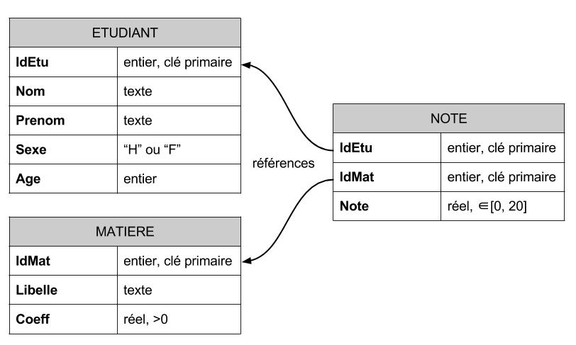

## Plan 

- Concepts relationnels
- Opérations usuelles
    - détails des opérations
    - application sur un exemple simple


## Concepts relationnels

### Qu'est-ce qu'une base de données ?

Ensemble de données simples (dites atomiques) réparties dans des tables et 
reliées entre elles, permettant le fonctionnement d'une organisation, d'une entreprise 
via une ou plusieurs applications informatiques.
	
-  Ensemble de données non indépendantes,
-  Interrogeable par le contenu (selon des critères),
-  Structure retrouvable.

### **SGBD** : Système de Gestion de Bases de Données

Ensemble des logiciels permettant aux utilisateurs d'insérer, de modifier et de 
rechercher efficacement des données spécifiques dans une grande masse d'informations 
partagée par de multiples utilisateurs.


## Introduction au modèle relationnel
	
### Objectifs du modèle

-  Indépendance des programmes avec la représentation interne des données,
-  Traitement des problèmes de cohérence et de redondance des données,
-  Utilisation de langages de manipulation de données non procéduraux,
-  Extensibilité du modèle pour des données complexes,
-  Standardisation pour la description et la manipulation des bases de données.


## Concepts et définitions

**Domaine** : Ensemble de valeurs caractérisées par un nom

**Cardinal** : Nombre d'éléments d'un domaine

Quelques exemples de domaines usuels :

```sql
Entier : 0, 1, 5, -4, 1324587, ...
Réel : 1.5, 3.14, -5.09, 10654.241687, 0.00000001, ...
Chaîne de caractères : "abcdef", "bonjour vous", "1", ...
Sexe : "H", "F" (ici, cardinal = 2)
Date : nombre de jours depuis une date de référence 
```


## Concepts et définitions

**Produit cartésien** : Ensemble des n-uplets ($d_1, d_2, \ldots, d_n$) où chaque 
$d_i$ est un élément du domaine $\mathbf{D}_i$

Si on a un premier attribut `Code` dont le domaine est `{1, 2, 3, 4}` (cardinal = 4) et 
un autre `TVA` de domaine `{0, 5, 10}` (cardinal = 3), le produit cartésien des deux 
domaines `Codes X TVA` aura un cardinal de 12 (4 * 3) et prendra les valeurs suivantes :

```sql
{
	(1, 0), (2, 0), (3, 0), (4, 0), 
	(1, 5), (2, 5), (3, 5), (4, 5), 
	(1,10), (2,10), (3,10), (4,10)
}
```

## Concepts et définitions

- **Relation** (ou **table**) : Sous-ensemble du produit cartésien d'une liste de domaines
- **Attribut** : Colonne d'une relation
- **Tuple** : Ligne d'une relation correspondant à un enregistrement
- **Schéma** : Nom suivi de la liste des attributs et de la définition de leurs domaines.

***


## Règles d'intégrité structurelles

### Contrainte de domaine

- Permet de définir l'ensemble de valeurs possibles pour chaque attribut
- Important pour limiter les erreurs (mettre un caractère dans un entier par exemple)
- Attention à ne pas trop restreindre (choisir un entier alors qu'il est possible qu'à 
l'avenir il y ait des réels par exemple)

## Règles d'intégrité structurelles

### Unicité de la clé

- Attribut (ou groupe d'attributs) permettant d'identifier chaque ligne de la table de manière unique
- Soit naturel (par exemple numéro de sécurité sociale), soit automatique
- Cela permettra de faire des liens entre lignes de plusieurs tables sans ambiguïté
- On parle aussi de **clé primaire**

## Règles d'intégrité structurelles

### Contrainte d'entité

- Une clé primaire ne peut pas avoir de valeur `NULL` (non-présence de l'information)
- Il doit absolument y avoir une valeur pour l'attribut, ou pour chaque attribut dans le 
cas d'une clé multiple

### Contrainte de référence

- Attribut(s) d'une relation devant apparaître comme clé dans une autre relation
- On doit bien évidemment indiquer la table, et le nom de l'attribut (si celui-ci n'a 
pas le même nom)
- On parle aussi de **clé externe**

## Exemple de BD simple



## Exemple de BD simple

```sql
Table : Etudiant 
```

```sql
  IdEtu      Nom    Prenom Sexe Age
1     1    Remin   Norbert    H  19
2     3 Constant Raphaelle    F  20
3     4  Fleurot  Isabelle    F  19
4     5   Yannic  Sandrine    F  18
5     6    Josse   Francis    H  20
```

## Exemple de BD simple

```sql
Table : Matiere 
```

```sql
  IdMat Libelle Coeff
1     1   Maths   1.0
2     2   Stats   3.0
3     3     Com   1.0
4     5     SQL   2.5
```

## Exemple de BD simple

```sql
Table : Note 
```

```sql
  IdEtu IdMat Note
1     3     1   12
2     3     5   15
3     4     5    2
4     4     2    9
5     4     1    7
6     1     1   18
7     1     2   11
8     1     5    5
9     6     1    9
```


## Opérations usuelles

- Sur une table :
  	- Restriction
  	- Projection
  	- Calcul ou fonction
  	- Agrégat
- Sur deux tables ayant le même schéma (i.e. les mêmes colonnes) :
  	- Union, Intersection, Différence
- Sur deux tables quelconques :
  	- Jointure

## Restriction

Sélection de lignes d'une table, sur la base d'une condition à respecter (cette condition 
peut être une combinaison de comparaison à l'aide de `AND` et de `OR` - attention aux 
parenthèses dans ce cas)

- Restriction sur `Age >= 19`, sur la table `Etudiant`

```sql
 IdEtu      Nom    Prenom Sexe Age
     1    Remin   Norbert    H  19
     3 Constant Raphaelle    F  20
     4  Fleurot  Isabelle    F  19
     6    Josse   Francis    H  20
```

## Projection

Sélection de colonnes d'une table, sur la base d'une liste d'attributs

- Projection sur `Prenom` et `Sexe`, sur la table `Etudiant`

```sql
    Prenom Sexe
   Norbert    H
 Raphaelle    F
  Isabelle    F
  Sandrine    F
   Francis    H
```

## Calcul

Opération artihmétique, fonction mathématique, fonction sur chaîne de caractères, ...

- Calcul de l'année de naissance (`2015 - Age`), dans la table `Etudiant`

```sql
 IdEtu      Nom    Prenom Sexe Age 2015 - Age
     1    Remin   Norbert    H  19       1996
     3 Constant Raphaelle    F  20       1995
     4  Fleurot  Isabelle    F  19       1996
     5   Yannic  Sandrine    F  18       1997
     6    Josse   Francis    H  20       1995
```

## Agrégat

Calcul statistique (somme, moyenne, nombre de valeurs, ...) sur un attribut, 
éventuellement en fonction des valeurs d'un autre attribut

- Calcul de la moyenne d'âge globalement, puis par sexe

```sql
 AVG(Age)
     19.2
```

```sql
 Sexe AVG(Age)
    F     19.0
    H     19.5
```

## Opérations ensemblistes

Création de deux tables pour opérations ensemblistes :

- A : Etudiants masculins (restriction à `Sexe = "H"`)

```sql
 IdEtu   Nom  Prenom Sexe Age
     1 Remin Norbert    H  19
     6 Josse Francis    H  20
```

- B : Etudiants de 20 ans (restriction à `Age = 20`)

```sql
 IdEtu      Nom    Prenom Sexe Age
     3 Constant Raphaelle    F  20
     6    Josse   Francis    H  20
```

## Union

Ensemble des lignes présentes dans l'un et/ou l'autre des deux tables, celles devant avoir les **mêmes** colonnes

- $A \cup B$ : étudiants masculins **ou** ayant 20 ans (*ou les deux*)

```sql
 IdEtu      Nom    Prenom Sexe Age
     1    Remin   Norbert    H  19
     6    Josse   Francis    H  20
     3 Constant Raphaelle    F  20
     6    Josse   Francis    H  20
```

*une même ligne peut être présente dans les deux tables : à gérer si on veut ne l'avoir qu'une seule fois*

## Intersection

Ensemble des lignes présentes dans les deux tables simultanément, celles devant avoir les **mêmes** colonnes

- $A \cap B$ : étudiants masculins **et** ayant 20 ans

```sql
 IdEtu   Nom  Prenom Sexe Age
     6 Josse Francis    H  20
```

*L'union et l'intersection sont* **commutatives** *au contraire de la différence (cf ci-après)*

## Différence

Ensemble des lignes présentes dans la première table et absentes dans la deuxième table, les deux devant avoir les **mêmes** colonnes

- $A \setminus B$ : étudiants masculins n'ayant pas 20 ans

```sql
 IdEtu   Nom  Prenom Sexe Age
     1 Remin Norbert    H  19
```

- $B \setminus A$ : étudiants de 20 ans n'étant pas masculin

```sql
 IdEtu      Nom    Prenom Sexe Age
     3 Constant Raphaelle    F  20
```
	
## Produit cartésien

Association de chaque ligne de la première table avec chaque ligne de la deuxième table

- Produit cartésien entre `IdMat` et `IdEtu`

```sql
 IdMat IdEtu
     1     1
     1     3
     1     4
     1     5
     1     6
     2     1
     2     3
     2     4
     2     5
     2     6
     3     1
     3     3
     3     4
     3     5
     3     6
     5     1
     5     3
     5     4
     5     5
     5     6
```

## Jointure

Restriction d'un produit cartésien aux lignes respectant une condition (le plus souvent égalité de deux attributs ayant le même nom)

- Jointure naturelle entre `Note` et `Matiere`

```sql
 IdEtu IdMat Note Libelle Coeff
     3     1   12   Maths   1.0
     3     5   15     SQL   2.5
     4     5    2     SQL   2.5
     4     2    9   Stats   3.0
     4     1    7   Maths   1.0
     1     1   18   Maths   1.0
     1     2   11   Stats   3.0
     1     5    5     SQL   2.5
     6     1    9   Maths   1.0
```

## Opération cruciale

- Organisées dans des tables différentes, 
- Absolument nécessité des jointures.

- **Jointure naturelle** : la restriction est sur l'égalité des attributs ayant le même nom entre les deux tables ;
- **Jointure interne** : on ne garde que les lignes ayant des informations dans les deux tables ;
- **Jointure externe gauche** (et respectivement **droite**) : on garde aussi les lignes de la table de gauche (resp. de droite) qui n'ont pas de connexion avec une ligne de l'autre table ;
- **Jointure externe complète** : toutes les lignes des deux tables sont conservées.

## Jointure externe gauche

- Jointure externe gauche entre `Etudiant` et `Note`

```sql
 IdEtu      Nom    Prenom Sexe Age IdEtu IdMat Note
     1    Remin   Norbert    H  19     1     1   18
     1    Remin   Norbert    H  19     1     2   11
     1    Remin   Norbert    H  19     1     5    5
     3 Constant Raphaelle    F  20     3     1   12
     3 Constant Raphaelle    F  20     3     5   15
     4  Fleurot  Isabelle    F  19     4     1    7
     4  Fleurot  Isabelle    F  19     4     2    9
     4  Fleurot  Isabelle    F  19     4     5    2
     5   Yannic  Sandrine    F  18    NA    NA   NA
     6    Josse   Francis    H  20     6     1    9
```

*L'étudiante n'ayant pas de note est conservée mais des valeurs `NULL` (indiquées par des `NA` ici)*

## Opérations combinées : exemple 1

- Prénom, libellé de la matière et note obtenue, trié par matière
  - 2 jointures
  - Projection

```sql
    Prenom Libelle Note
 Raphaelle   Maths   12
  Isabelle   Maths    7
   Norbert   Maths   18
   Francis   Maths    9
 Raphaelle     SQL   15
  Isabelle     SQL    2
   Norbert     SQL    5
  Isabelle   Stats    9
   Norbert   Stats   11
```

## Opérations combinées : exemple 2

- Matière et moyenne, par ordre décroissant de moyenne
    - 2 jointures
    - Calcul d'agrégat
	  - Tri

```sql
 Libelle Moyenne
   Maths    11.5
   Stats    10.0
     SQL     7.3
```

> Possibilité (quasi-infinie) de combiner toutes les opérations


## Traduction en SQL

```sql
SELECT { attribut | expression | fonction } [, ... ]
	FROM table [, ...]
	WHERE condition(s)
	GROUP BY attribut(s)
	HAVING condition(s) 
	ORDER BY attribut(s)/nombre(s);
``` 

- Les jointures se font dans le `FROM` ;
- La clause `WHERE` permet de faire les restrictions ;
- Les projections se font dans le `SELECT` ;
- Les calculs et agrégats sont à faire dans le `SELECT`, avec les attributs de regroupement d'agrégat dans le `GROUP BY` ;
- Il est possible de faire des conditions spécifiques sur ces agrégats dans le `HAVING` ;
- On peut effectuer un tri du résultat dans la partie `ORDER BY`.


## Traduction en R

```r
subset(table, subset = condition(s), select = attribut(s))
transform(table, attribut = expression(s))
aggregate(attribut ~ attribut(s), table, fonction)
merge(table, table, ...)
``` 

- Les projections et restrictions peuvent se faire avec la fonction `subset` ;
- Les calculs se font dans la fonction `transform` ;
- Tout ce qui est calcul d'agrégat est à faire avec la fonction `aggregate` ;
- Les jointures se font dans la fonction `merge`.

> Il est souvent possible de réaliser des opérations selon la logique relationnelle et d'autres selon une logique plus spécifique au langage R. Il est présenté ici les fonctions orientées relationnel.

## Traduction en SAS

```sas
data table;
	merge table table;
	attribut = expression;
	where condition(s);
	keep | drop attribut(s);
run;
proc means | freq;
run;
```

- La clause `merge` permet de déterminer les tables pour les jointures ;
- Les projections se font dans le `keep` ou le `drop` ;
- Les restrictions sont détaillées dans le `where` ;
- Les calculs classiques se font dans l'étape `data` et les agrégats dans une procédure 
`summary`, `means` ou `freq`.

> Idem que pour R, différentes voies sont parfois possibles.

## Pour aller plus loin

Interrogation de données avec :

- [SQL](interrogation-sql.html)
- [R](interrogation-r.html)
- [SAS](interrogation-sas.html)
- [MongoDB](interrogation-mongo.html)

