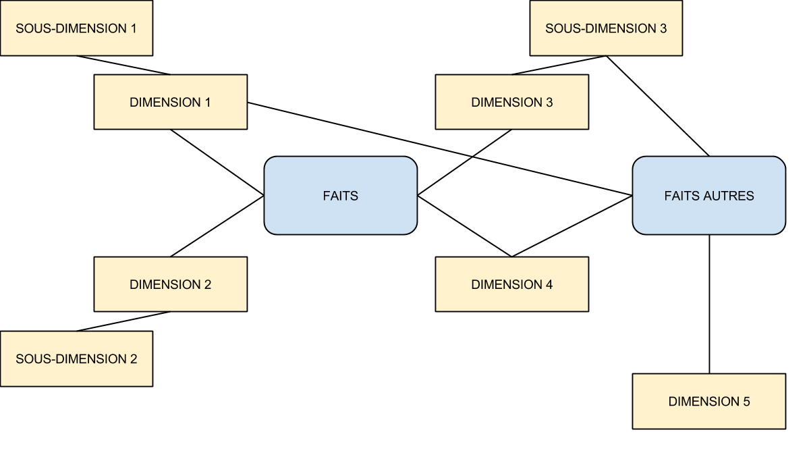

## Plan du cours

- Contraintes
  - Pourquoi dénormaliser ?
  - Optimisation du temps
  - Lisibilité du modèle
  - Axes de qualification
- Démarche
  - Dénormalisation
  - Modélisation dimensionnelle
  - Étapes de la modélisation
  - Différents modèles
- Atouts et faiblesses

## Pourquoi dénormaliser ?

- Contexte décisionnel
  - Mise à jour par des systèmes de productions
  - Pas de maj en ligne
  - Intégrité de l’entrepôt jamais remis en cause
  - Nécessité de faire des requêtes complexes avec un temps de réponse relativement court
- Solution
  - Possibilité d’introduire de la redondance
  - Dénormalisation des tables

## Optimisation du temps

- Contexte décisionnel
  - Requêtes sur des grands ensembles
  - Utilisation fréquente d’agrégats, de regroupements, de calculs, ...
  - Temps de réponse plus important qu’en transactionnel Solution
- Solution 
  - Limitation du nombre de tables
  - Optimisation des requêtes fréquentes via des index, du partitionnement, ...

## Lisibilité du modèle

- Contexte décisionnel
  - Lien entre éléments non corrélés
  - Requêtes complexes
  - Utilisation par un non-informaticien
  - Volonté de réactivité importante du système
- Solution
  - Nécessité d’avoir un modèle lisible et intuitif
  - Modèle des données évolutif

## Axes de qualification

- Axes de qualification d’un modèle décisionnel
  - Lisibilité
  - Performances en terme de chargement
  - Performances en terme d’exécution
  - Administration
  - Évolutivité
- Axes antagonistes 
  - Exécution rapide → Redondances, agrégations, calcul  → Chargement long & Administration complexe 
- Associer un poids à chaque axe 
- Trouver le bon équilibre

## Dénormalisation

- Pas de technique formelle
- Approche pragmatique nécessaire
- Analyse précise des besoins des utilisateurs 
- Définition des sujets d’intérêt majeur
- Quelques points important :
  - Une table → un sujet d’intérêt
  - Moins de tables → moins de jointures
  - Tables plus volumineuses
  - Requêtes plus simples

## Modélisation dimensionnelle

- Analyse de la performance
- Utilisation d’un ensemble d’indicateurs (ou **Faits**)
  - Taux d’occupation des lits dans un hôpital
  - Nombre de produits en stock
  - Montant d'un achat
  - ...
- Indicateurs analysés en terme de **Dimensions** (axe d’analyse)
  - Temps, Localisation, Clients, Service, ...
- Table de faits regroupant les indicateurs ayant le même ensemble de dimensions

## Etapes de la modélisation

1. Choix du processus à modéliser
  - Activité de l’organisation et écoute des utilisateurs
  - Pas attaché à un service ou à une fonction
2. Définition de la granularité du processus
  - Niveau de détails des mesures d’une ligne de la table de faits
  - Étape critique et obligatoire
3. Choix des dimensions
  - Caractéristiques de la table des faits
4. Identification des faits
  - Mesures à mettre dans la table de faits
  - Au niveau de granularité de l’étape 2

## Sélection du processus

- Première étape de la conception : choix du processus à modéliser
- Choix du modèle avec la plus forte incidence
  - Répondre aux questions les plus pressantes des utilisateurs
  - Données faciles à extraire
- Affinement et extension du modèle par étape 
  - Création d’autres modèles par la suite
- Se focaliser sur les processus et non les services
- Assurer la cohérence des données en les publiant une seule fois avec un nombre réduit de modèle

## Choix du grain

- Décision importante et cruciale dans la modélisation
- Répondre à la question
  - Quel niveau de détail doit-il être rendu disponible dans le modèle dimensionnel ?
- Développer les modèles dimensionnels basés sur les données les plus atomiques et donc les plus détaillées
  - Données hautement dimensionnelles
  - Souplesse maximale d’analyse
- Élévation du grain entrainant la réduction de dimensions et la vulnérabilité face aux demandes inattendues

## Granularité

| Caractéristiques | Transaction                | Instantané périodique                    | Instantané récapitulatif |
|------------------|----------------------------|------------------------------------------|--------------------------|
| Période de temps | Point dans le temps        | Intervalles réguliers prévisibles        | Durée in- determinée, généralement courte | 
| Grain            | Une ligne par événement    | Une ligne par période                    | Une ligne pour la vie de l’entité | 
| Chargement       | Insertion                  | Insertion                                | Insertion et mise à jour | 
| Mise à jour ?    | aucune                     | aucune                                   | Mise à jour pour chaque activité | 
| Dimension date ? | Date de la transaction     | Date de la fin de période                | Dates multiples pour des étapes standard |
| Faits            | Activité de la transaction | Performance dans un intervalle prédéfini | Performance sur une durée de vie limitée | 

## Choix des dimensions

- Choix naturel une fois le grain de la table de faits choisi pour les dimensions pricipales
- Dimension supplémentaire ne remettant pas en cause le grain choisi (sinon revoir l’étape précédente)
- Séparation de date et d’heure (dimensions souvent présentes)
- Pas de soucis en terme d’espace car tables généralement petites par rapport à la table de faits
- Différents forages possibles
  - Vers le bas : ajout d’un attribut à l’intérieur de la hiérarchie naturelle de la dimension ou non
  - Vers le haut : suppression d’attributs

## Dimensions dégénérées

- Clés de dimension ne correspondant pas à des tables de dimensions
- Courantes avec une granularité au niveau d’une seule transaction ou d’un élément d’une transaction
- Exemple :
  - Numéro de transaction d’un Terminal Point de Vente pour une table de faits achats dans un magasin
  - Numéro de commande, de facture, de lettre de transport, ...
- Partie de la clé primaire de la table de faits généralement

## Identification des faits

- Choix en fonction de la granularité définie
- Remise en cause possible de l’étape de définition de la granularité
- Estimation utile du nombre de lignes de la table de faits
- Possibilité de calculer des faits à partir d’autres faits de la table
  - Ex : Prix unitaire moyen d'un produit
  - Fait : prix unitaire à chaque vente + quantité vendue

## Faits additifs et non additifs

- Attention aux faits additifs et non additifs
  - Sommes additives
  - Pourcentages et ratios (dont moyennes) non additifs
  - Stockage du numérateur et du dénominateur dans la table de faits
  - Faire le ratio des sommes et non la somme des ratios
- Prix unitaire non additif 
  - Additionner les ventes en euro et les quantités
  - Rapport = prix moyen d’un produit sur une période

## Schémas de modélisation

3 types de schéma du plus simple au plus complexe :
- En étoile
- En flocon
- En constellation 

Dimensions conformes	
- Dimensions potentiellement partagées par des tables de faits différentes	
- Cohérence, Intégration, Productivité

## Schéma en étoile

- Une seule table de faits
- Plusieurs tables de dimensions, toutes rattachées directement à la table de faits

## Schéma en flocon de neige

- Normalisation des dimensions
- Notion de hiérarchie au sein d’une dimension

## Schéma en constellation de faits

- Plusieurs tables de faits
- Tables de dimensions reliées à une ou plusieurs tables de faits

## Atouts et faiblesses de la modélisation dimensionnelle

- Atouts
  - Lisibilité
  - Performance
  - Possibilité d’acquisition de l’expérience
- Faiblesses
  - Manque de complétude
  - Ajout d’une dimension parfois complexe
  - Fondamentalement orientée métier
- Modélisation dimensionnelle adaptée pour les magasins de données, plutôt que pour les entrepôts de données

## Exemple : Northwind

