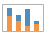
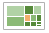

Dans **Tableau Public**, ouvrez le résultat obtenu suite au TP1 ([workbook téléchargeable](reporting/tp2/Reporting - TP1.twbx)). Vous noterez que tous les graphiques sont présents avec une couleur dans l'onglet en bas, permettant de repérer quels graphiques sont pour quels tableaux. Les données sont intégrées dans le fichier.

## Création d'une table de contingence, avec les pourcentages en lignes ou en colonnes

- Double-cliquer sur *DUT*
- Double-cliquer sur *Parcours Libelles*
- Double-cliquer sur *Number of records*
- Vous obtenez la table de contingence des deux variables (i.e. le nombre de répondants ayant telle modalité pour la première variable et telle autre modalité pour l'autre variable - ici 23 diplômés `STID` ont fait trois ans d'études).
- Il serait intéressant d'avoir ce qu'on appelle des profils : par exemple, parmi les diplômés de `STID`, quelle est la proportion de répondants qui ont été travaillé, ont fait une année, deux années ou trois années d'études.
- Aller dans le menu *Analysis* puis *Percentage of rows*.
- On a maintenant la répartition en pourcentage des différents parcours, pour chaque DUT, ce qui est plus pratique pour les comparer.

### Avec un diagramme en barres empilées

Pour avoir la même représentation, mais graphique cette fois-ci, il faut créer ce qu'on appelle un diagramme en barres empilées.

- A partir du tableau obtenu précédemment, cliquer sur l'icône suivante 
- Comme la variable *DUT* est passée en colonne, les pourcentages ne sont plus corrects.
- Aller dans *Analysis* puis *Percentage of* (remarquez que *None* est cochée), et cliquer sur *Column*.

## Utilisation d'un graphique comme filtre

- Reprenez le *dashboard* nommé *Reporting 1*.
- Faites un clic-droit dans le graphique *Répartition DUT*, puis cliquer sur *Use as filter*.
- Une fois cela fait, lorsque vous cliquez sur un département, les autres graphiques (*Répartition Sexe* et carte *Origine Etudiants*) sont mis à jour. Elles ne concernent que les étudiants du département sélectionné.
- La carte est fixe, car elle est dite *épinglée* (cf le dessin d'épingle quand on passe la souris dessus). Ceci permet que son affichage ne change pas à chaque clic de souris. Ce n'est pas le comportement par défaut. Pour l'obtenir (ou revenir à l'état initial), il suffit de cliquer sur l'épingle. Si vous faites cela, en cliquant sur `INFO`, on remarque que la carte est zoomée par rapport aux autres départements.

Il est aussi possible de créer des filtres permettant le choix de plusieurs modalités (clic-droit puis *Quick filters*).

## Création d'une nouvelle variable

Il est possible de créer des nouveaux champs directement dans **Tableau**.

- Faire un clic-droit dans l'espace vide en-dessous des *measures* ou aller dans le menu *Analysis*.
- Cliquer sur *Create calculated field*, une fenêtre devrait apparaître.
- Donner lui un nom (*Age* ici).
- Cliquer dans l'espace vide en dessous du nom de la variable.
- En cliquant sur la flèche à droite, il est possible d'avoir accès aux différentes fonctions présentes dans **Tableau**
- Sélectionner les fonctions de *Date* et double-cliquer sur `DATEDIFF`.
- Le premier paramètre est l'unité utilisée pour le retour de la fonction (ici `"year"` - n'oubliez pas les `" "`).
- Ensuite, on va commencer à écrire le nom de la variable qui nous intéresse (ici *Date de naissance*). **Tableau** reconnaît les mots-clés (fonctions ou variables) commençant par les lettres tapées. Choississez la *Date de naissance*.
- Enfin, on va prendre la *Date d'enregistrement* pour avoir l'âge en année au moment de l'enquête donc.
- Vous devriez avoir comme formule  `DATEDIFF("year", [Date de naissance], [Date Enregistrement])`
- Cliquer sur *OK*. La variable *Age* s'est ajoutée dans les *measures* à gauche.

## Création d'un nuage de points, avec tendance

- Double-cliquer sur *Age*.
- Double-cliquer sur *Durée de saisie*.
- Vous ne devriez n'avoir aucun rendu. Les variables sont considérées comme des *measures* et doivent être ici considérées comme des *dimensions*.
- Faites un clic sur la flèche présente lorsqu'on glisse la souris sur `SUM(Age)` dans la partie *Rows*, puis cliquer sur *Dimension*.
- Faites de même pour `SUM(Duree Saisie)`.
- On voit ainsi un nuage de points apparaître, l'âge en fonction de la durée de saisie. C'est plutôt dans l'autre sens qu'il faudrait le présenter. 
- Aller dans le menu *Analysis* puis cliquer sur *Swap rows and columns*. Le graphique a été transposé.
- On semble voir un lien mais on a une donnée très éloignée des autre (`58820` alors que la moyenne semble être autour de `2000`). Il est possible de l'exclure du graphique en faisant un clic-droit dessus, puis *Exclude*.
- Pour aller plus loin dans l'analyse de la tendance, **Tableau** propose de la représenter sur le graphique.
- Faites un clic-droit sur le graphique et aller dans *Trend lines* puis cliquer sur *Show trend lines*.
- Vous voyez apparaître une droite en gris foncé entre deux courbes en gris clair. Lorsque vous passez votre souris dessus, vous devez voir apparaître une équation, dont vous découvrirez au cours de cette année, dans les cours de statistiques, sa signification et comment on l'obtient.

## Création d'une hiérarchie

Une hiérarchie entre plusieurs variables permettra une navigation entre les différents éléments, nommée **drill-down**. Nous allons créer une hiérarchie sur la nature du DUT.

- Faites un clic-droit sur *Tertiaire/Secondaire* dans les *dimensions*.
- Cliquer sur *Hierarchy* puis *Create hierarchy*.
- Nommer la *Nature DUT*.
- Vous devriez la voir apparaître dans les *dimensions*.
- Pour la compléter, nous allons glisser les éléments suivants :
    - *DUT* à placer en dessous de *Tertiaire/Secondaire*, en faisant attention à ce qu'il soit bien dans la hiérarchie,
    - *Option de DUT* à placer en dessous de *DUT*, toujours dans la hiérarchie.
- Pour mieux comprendre l'intérêt d'une hiérarchie, créer une nouvelle *sheet*.
- Glisser *Nature DUT* dans les lignes.
- Glisser *Number of records* dans le tableau.
- Lorsque vous passer la souris sur les modalités de la variable, vous devriez voir apparaître un *+* au-dessus du nom de la variable.
- Cliquer sur le *+*. On voit les départements correspondants au secteur tertiaire (tous sauf `INFO`) et secondaire (seulement `INFO`).
- Cliquer sur le *+* au-dessus de *DUT*. On voit maintenant les options des différents DUT.
- Pour revenir en arrière, il suffit de cliquer sur le *-*.
    
## Création d'un *treemap*

On va utiliser cette hiérarchie pour créer une représentation moins traditionnelle mais très utilisée en ce moment, un *treemap*.

- Refaire une *sheet* avec *Nature DUT* en ligne et *Number of Records* en contenu de cellule.
- Cliquer sur l'icône suivante : 
- Pour naviguer dans la hiérarchie, vous devez maintenant cliquer sur les *+* ou *-* qui sont dans la fenêtre *Marks*.
- Malheureusement, l'intégration de d'un *treemap* dans un *dashboard* ou une *story* n'intégre pas la possibilité de ce drill-down direcetement, au contraire d'autres représentations.

## Utilisation du mode *Story*

Ce mode permet d'intégrer plusieurs *dashboards* (ou *sheets* mais c'est peut-être moins intéressant) et d'avoir un menu permettant de naviguer parmi ceux-ci.

- Aller dans le menu, cliquer sur *Story* puis *New story*.
- Double-cliquer sur `Titre de l'histoire` puis écrire *Enquête DUT + 2,5 ans*.
- Glisser le tableau *Reporting 1* dans le grand cadre.
- Double-cliquer sur *Add a caption* pour écrire *Origine*.
- Ensuite, cliquer sur *New Blank ...*.
- Glisser le tableau *Reporting 2* et donner comme légende *Devenir*.
- Comme vous pouvez le voir, ainsi, il est possible de naviguer entre les deux tableaux :
    - soit en cliquant directement sur la légende associée,
    - soit avec les flèches gauche et droite pour naviguer.

## A FAIRE

Il existe beaucoup d'autres possibilités de représentations et de choix. Testez différents choix de graphiques ou tableaux.

    
