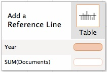

Dans ce TP, nous allons utiliser les données synthétiques de la production scientifique mondiale de 1996 à 2014 ([lien vers le fichier Excel](reporting/tp5/scimagojr%20all.xlsx) - source : [SCImago Journal & Country Rank](http://www.scimagojr.com/help.php))

Ce fichier comporte les variables suivantes :

- `Year` : année
- `Rank` : rang du pays en terme de production (par rapport au nombre de documents) pour l'année indiquée
- `Country` : pays
- `Documents` : nombre de documents produits
- `Citable.documents` : nombre de documents citables (articles, reviews et conférences)
- `Citations` : nombre de citations de documents produits
- `Self.Citations` : nombre de citations dans un document du même pays
- `Citations.per.Document` : nombre moyen de citations
- `H.index` : nombre $h$ d'articles ayant eu au moins $h$ citations (pour plus d'information : [h-index sur Wikipedia](https://fr.wikipedia.org/wiki/Indice_h))

## Evolution de valeurs d'échelles différentes

Dans la première *sheet*, nous voulons voir l'évolution de la production scientifique de différents pays entre 1996 et 2014. Pour cela, nous devons d'abord réaliser les étapes suivantes :

### Evolution globale 

1. Mettre la mesure `Documents` dans le contenu du tableau
2. Mettre `Year` dans les colonnes 
3. Cliquer sur *Lines* dans le panneau *Show me*

On voit que la production scientifique mondiale a nettement progressé, particulièrement après 2002. Pour indiquer ce changement, il peut être intéressant de le marquer avec une droite verticale, pour que ce soit très clair. Pour cela, il faut :

1. Cliquer sur l'onglet *Analytics* dans le panneau à gauche
2. Cliquer-Déplacer *Constant Line* sur le graphique. Vous devriez voir apparaître une fenêtre comme suit :

3. En gardant votre clic, placez-vous sur la cellule à droite de `Year` de manière à ce qu'elle soit en surbrillance comme ci-dessus
4. Ensuite, indiquer `2002`. Vous devriez voir apparaître une ligne verticale pour l'année 2002
5. Il est possible de personnaliser le texte affiché à droite. Cliquer sur le 2002 et cliquer sur *Edit*
6. Choississez *Custom* pour le *Label* et écrivez ce que vous voulez voir apparaître ("Changement" par exemple)

On voit aussi qu'il y a un recul de la production à partir de 2013. Indiquer aussi cette année.

### Focus sur différents pays

On veut maintenant voir l'évolution des pays suivants :

- `United States`
- `France`
- `China`
- `Germany`
- `United Kingdom`

1. Glisser-Déplacer `Country` sur *Color* dans le panneau *Marks*
2. Il indique qu'il y a trop de valeurs et vous propose entre autres de filtrer (ce que nous voulons faire). Cliquer sur *Filter and then add*
3. Sélectionner les pays voulus puis *OK*. Vous verrez qu'il y a un outil de recherche dans la fenêtre de filtre

Il est ici difficile de voir l'évolution des pays européen car la production est nettement inférieur. Ceci est bien évidemment du à la différence de taille entre les pays. 

### Evolution comparable (en base 100)

Il faut donc se ramener à une comparaison par rapport à la valeur initiale (en 1996 donc) pour chaque pays. On parle d'**évolution en base 100**.

1. Cliquer sur la petite fenêtre à droite de `SUM(Documents)` pour personnaliser le calcul d'agrégat
2. Choisir *Add Table Calculation...*
3. Choisir *Percent From* dans le type de calcul et *First* pour l'affichage de la valeur, puis *OK*
4. Ajouter une ligne de référence horizontale à 100%, comme précédemment pour 2002

On voit clairement ici que la Chine a très nettement progressé, au contraire des autres pays, même après 2013. On souhaiterait pouvoir sélectionner simplement les pays affichés. Pour cela, faire ce qui suit :

1. Dans le panneau *Filters*, cliquer sur la flèche à droite de *Country*
2. Cliquer sur *Show quick filter*
3. Vous pouvez maintenant sélectionner et déselectionner les pays de votre choix

Regarder l'évolution impressionnante de certains pays tels que :

- `Serbia`
- `Macao`
- `Montenegro`
- `Afghanistan`
- `Iran`
- `Qatar`
- ...

Le filtre rapide devrait être affiché si vous intégré la *worksheet* dans un *dashboard*.

## TOP personnalisable des pays

Dans cette partie, on va vouloir créer un top des meilleurs pays en terme de production scientifique. L'intérêt ici sera qu'on va laisser l'utilisateur choisir le nombre de pays affichés (3, 5, 10, ...) et sur quelle année il veut son top.

Dans **Tableau**, il est possible de créer des paramètres qu'on pourra ajuster via des interfaces graphiques. C'est ce que nous allons utiliser ici.

### Création d'un TOP 10 simple

Il est courant de vouloir un **Top** (nombre limité d'entités classées par ordre décroissant). On pourrait vouloir faire un **Top 10**. Voici comment faire :

1. Dans une nouvelle *sheet*, mettez la mesure `Documents` dans les cellules et *Country* en lignes
2. Faire un clic-droit sur le *Country* dans le tableau et sélectionner *Sort...*
3. Choisir *Descending* et *Fields* (le choix par défaut est bon : agrégat `SUM` sur *Documents*)

On a maintenant les pays classés par ordre décroissant de leur production globale.

On voudrait maintenant se limiter à un certain nombre de pays. Pour cela, faire comme suit :

1. Glisser-Déplacer *Country* dans le panneau *Filters*
2. Choisir l'onglet *Top*
3. Sélectionner *By field* (les choix par défaut nous conviennent : Top 10 sur l'agrégat `SUM` sur Documents)

### Choix du nombre de pays pour le TOP

On peut donc laisser le choix du nombre à afficher à l'utilisateur du reporting. Pour cela, faire comme suit :

1. Faire un clic-droit dans le vide du panneau de gauche et choisir *Create Parameter...*
2. Donner lui un nom (par exemple `Para choix N`)
3. Choisir *Integer* comme type et cliquer sur *List* pour définir les valeurs possibles 
4. Cliquer pour ajouter les valeurs (ici 3, 5, 10 et 50 par exemple)
5. Noter que la valeur par défaut est la première indiquée mais que c'est modifiable si besoin
6. Cliquer sur *OK*
7. Cliquer sur la flèche à droite de `Country` dans le panneau `Filters` et cliquer sur *Filter...* pour le modifier
8. Retourner dans l'onglet *Top* 
9. Si vous cliquer sur la flèche à droite du 10, vous pouvez sélectionner votre paramètre (`Para choix N` donc normalement)
10. Vous avez maintenant un TOP 3
11. Pour afficher le contrôle du paramètre, cliquer sur la flèche à droite du paramètre dans le panneau de gauche et choisir *Show Parameter Control*
12. Vous pouvez maintenant sélectionner le nombre de pays affichés dans votre TOP

### Choix de l'année du TOP

Le TOP ainsi affiché est fait sur l'ensemble des années. On peut vouloir un TOP sur une année spécifique. Nous allons devoir créer un paramètre et une champ calculé pour réaliser ceci :

1. Comme précédement, créer un paramètre
2. Nommer-le `Para choix année`
3. Choisir *Integer* pour le type et *List* pour les valeurs
4. Plutôt que de recopier les années, nous pouvons les récupérer directement. Cliquer sur *Add from field* et sélectionner `Year`
5. Choisir `2014` comme valeur par défaut puis cliquer sur *OK*
6. Créer un *Calculated Field...* et nommer-le `Choix année`
7. Nous allons créer une variable binaire qui sera égale à 1 si l'année est celle choisie. Voici la formule à indiquer : 
```
IF ([Year] = [Para choix année]) THEN 1 ELSE 0 END
```
8. Faire un clic sur la flèche à droite du champ `Choix année` et cliquer sur *Convert to Dimension*
9. Glisser-déplacer cette dimension dans le panneau *Filters* 
10. Sélectionner la valeur 1 et cliquer sur *OK*
11. Afficher le contrôle du paramètre `Para choix année` pour pouvoir choisir l'année présenté

Pour information, les contrôles des paramètres devraient s'afficher lors de l'intégration de la *worksheet* dans un *dashboard*.

## A FAIRE

Réaliser les *worksheets* suivants :

- Le nuage de points entre le nombre moyen de documents produits par an et le nombre moyen de citations par an, pour chaque pays, avec
    - le nom de chaque pays indiqué sur le graphique
    - une couleur (entre du vert pour le 1er et du rouge pour le dernier) par pays en fonction de son rang médian
    - une taille en fonction du H-index moyen
    - deux lignes de références au niveau des moyennes de chaque variable
    - des axes logarithmiques
- Une représentation graphique de l'évolution des rangs des pays, uniquement sur les 10 premiers rangs, avec le pays en 1er en haut, avec
    - une couleur par pays
    - le nom de chaque pays sur le graphique
- Une carte des pays dont le H-index moyen est supérieur à une valeur choisie par l'utilisateur, avec
    - valeurs dans le domaine des valeurs possibles pour cet indice,
    - la couleur des pays dépendante de la valeur de l'indice, avec une échelle de couleur fixe
- Une carte des pays représentant le TOP réalisé plus haut avec
    - une sélection des pays identique à celle du TOP
    - idem pour l'année
    - une couleur dépendante du nombre de documents produits

De plus, réaliser :

- Un *dashboard* intégrant le TOP et la dernière carte, avec
    - le contrôle du nombre de pays, sous forme de *radio button* (bouton rond avec sélection unique)
    - le contrôle de l'année, sous forme de *slider*
- Une *story* regroupant tous ces éléments de manière cohérente

