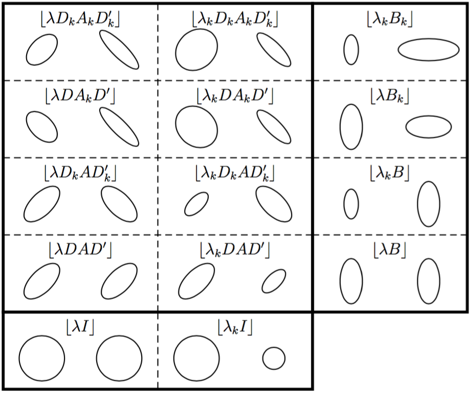
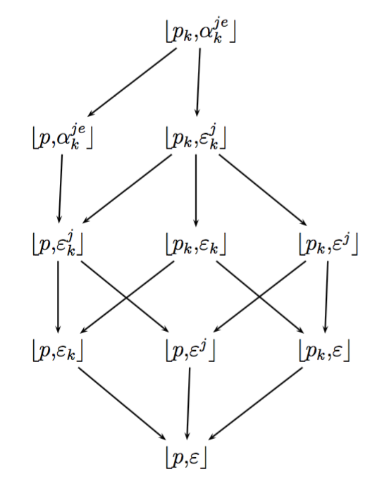

```{r setup, include=FALSE}
knitr::opts_chunk$set(echo = FALSE, fig.align = "center", fig.width = 10, fig.height = 4)
```

## Informations

<div class="columns-2">
### Plan

1. Problème de classification
    - Partition
    - Hiérarchie
2. Modèles de mélange
    - Algorithmes EM et CEM
3. Nombre de classes
    - Critères de choix
4. Applications
    - avec code `R`

### Librairies `R` utilisées

```{r libraries, echo=TRUE, message=FALSE, warning=FALSE}
library(mclust)
library(knitr)
library(Rmixmod)
library(ggplot2)
library(reshape2)
library(NbClust)
library(gridExtra)
```
</div>

## Classification

- Réduction d'un nuage de points d’un espace quelconque en un ensemble de représentants moins nombreux
- Représentation simplifiée des données initiales : Méthode de réduction des données
- Applications nombreuses
- Deux grandes familles de classification : 
    - par partitionnement
    - par hiérarchie

*Notation* : Soit $x$ une matrice de données $n \times d$ définie par $x = {x^j_i ; i \in I; j \in J}$, où $I$ est un ensemble de $n$ objets (lignes, observations, instances, individus) et $J$ est un ensemble de $d$ variables (colonnes, attributs).

## Partition

**Définition** : Une partition de $I$ en $s$ classes ($s$ est supposé connu) est un ensemble de parties non vides $z_1,\dots,z_s$ vérifiant :

- $\forall k, k' = 1,\ldots,s , k \neq k', z_k \cap z_{k'} = \emptyset$, 
- $\cup^s_{k = 1} z_k = I$

- Nombre de partitions possibles très important
    - 1701 partitions possibles de 8 objets répartis en 4 classes
- Meilleure partition : problème très complexe
- Partition optimale localement

> On se place ici dans le cadre de partitions dites non-recouvrantes : un individu appartient à une et une seule classe

## Partitionnement 

- Classification directe
- Algorithme 
    1. Initialisation : $s$ points tirés au hasard pour les centres de gravité de chaque classe,
    2. Affectation : On affecte les points à la classe la plus proche,
    3. Représentation : On recalcule les nouveaux centres de gravité,
    4. On répète les étapes d’affectation et de représentation jusqu’à la convergence de l’algorithme (i. e. plus de changement de le partition).
- Résultats dépendant de l'initialisation
- Nombre de classes devant être connu
- Complexité linéaire

## $k$-means

- Critère à minimiser :
\[
    W(z,g) =  \sum_{k=1}^s \sum_{i \in z_k}  d^2(x_i,g_k)
\]
- Somme des inerties intra-classes
- Basé sur la distance euclidienne
- Très rapide dans la convergence et dans le calcul
    - Convergence assez rapide (moins de 20 itérations généralement)
- Connu et très utilisé
- Variables devant avoir la même échelle
    - Standardisation éventuellement nécessaire

## Inconvénients

- Données continues : $k$-means
    - Classes sphériques, et de même taille
    - Classes petites *vidées*
- Données binaires :
    - Adaptation du critère de $k$-means
    - Contrainte sur les centres des classes (pas de moyenne, mais valeur $0$ ou $1$ la plus présente)
- Données catégorielles : $k$-modes 
    - $k$-means avec la métrique du $\chi^2$
    - Problèmes similaires à $k$-means

## Fuzzy $c$-means

- Critère à minimiser :
\[
    J_m(\mu,g) =  \sum_{k=1}^s \sum_{i=1}^n (\mu_{ik})^m d^2(x_i,g_k)
\]
- $\mu = [\mu_{ik}]$ : degré d'appartenance de $i$ à la classe $k$ (entre 0 et 1)
- Un individu peut donc appartenir à plusieurs classes, avec un degré spécifique 
    - $\sum_k \mu_{ik} = 1$
- Problèmes similaires à $k$-means pour les formes des classes et les proportions

## Hiérarchie

**Définition** : Un ensemble $H$ de parties non vides de $I$ est une hiérarchie sur $I$ si

- $I \in H$
- $\forall i \in I, {i} \in H$
- $\forall h, h' \in H$, on a un des trois cas :
    - $h \cap h' = \emptyset$
    - $h \subset h'$
    - $h' \subset h$

- Ensemble de partitions emboîtées

On se place ici dans le cadre de la Classification ascendante hiérarchique (CAH) considérée ici

## Classification hiérarchique

- Algorithme
    1. Chaque objet est dans sa propre classe
    2. Calcul des distances entre les classes
    3. Regroupement des deux classes les plus proches 
        - Mise à jour des nouvelles distances
    4. Répétition de l'étape 3 jusqu'à n'avoir plus qu'une seule classe
- Pas de nécessité de connaître le nombre de classes
- Algorithme déterministe
- Complexité quadratique

## CAH

- Critères d'aggrégation à définir : simple, complet, médian, moyen, centroïde
- Le plus utilisé : Critère de **Ward**
$$
    \delta_{Ward} (z_h, z_{h'}) = \frac{\#z_h \times \#z_{h'}}{\#z_h + \#z_{h'}} d^2(z_h, z_{h'})
$$
- Basé sur la distance euclidienne (ou autre distance si besoin)
- Temps de calcul pouvant être long si $n$ grand
- Nouvelles distances calculées à partir des anciennes dans certains cas (dont Ward)

## Modèles de mélange

- Distribution de probabilité : mélange de $s$ distributions associées aux classes
- Cas d’une variable continue, avec deux classes présentes

```{r ex-modele, fig.width = 8, fig.height = 4}
x = data.frame(x = c(rnorm(n = 100, mean = 2, sd = 1), rnorm(n = 100, mean = 6, sd = 2)))
m = mixmodCluster(x, 2)
par(mar = c(2, 2, 2, 0) + 0.1)
histCluster(m["bestResult"], x, variables = 1)
rm(x, m)
```

## Densité de probabilité

- Tableau de données $x$ considéré comme échantillon $(x_1, \ldots,x_n)$ i.i.d. de taille $n$ d’une variable aléatoire avec la densité $\varphi(x,\theta)$ définie par :
\[
    \varphi(x_i;\theta) = \sum_{k=1}^s p_k \varphi_k (x_i;\alpha_k)
\]
- $\varphi_k(x_i, \alpha_k)$ : densité de probabilité de la classe $k$
- $p_k$ : probabilité qu’un élément de l’échantillon suive la loi $\varphi_k$ (proportions du mélange)
    - $\forall k=1,\ldots,n, p_k \in ]0,1[$
    - $\sum_{k=1}^s p_k = 1$
- $\theta = (p_1, \ldots ,p_s; \alpha_1, \ldots ,\alpha_s)$ : paramètre du modèle de mélange

## Vraissemblance

- Problème statistique : estimer les proportions des composants ( les $(p_k)$) et les paramètres (les $(\alpha_k)$)
- Utilisation de la log-vraisemblance :
\[
    L(x_1,\ldots,x_n;\theta) = \sum_{i=1}^n \log \left( \sum_{k=1}^s p_k \varphi_k (x_i;\alpha_k) \right)
\]
- Pour la classification, chaque $x_i$ appartiendra à une classe $k$, tel que $z_{ik} = 1$ (et 0 sinon)
- Log-vraissemblance complétée (ou classifiante) :
\[
    L_c(x_1,\ldots,x_n; z, \theta) = \sum_{i=1}^n \sum_{k=1}^s z_{ik} \log\left( p_k \varphi_k (x_i;\alpha_k) \right)
\]

## Trois approches

- Approche **Estimation**
    - Estimation des paramètres du mélange
    - Déduction de la partition, avec la méthode du maximum a posteriori *MAP*
    - Maximisation de la log-vraisemblance $L(x; \theta)$
    - Utilisation de l'lagorithme **EM**
- Approche **Classification**
    - Estimation conjointe des paramètres et de la partition
    - Maximisation de la log-vraisemblance classifiante $L_C(x; z, \theta)$
    - Utilisation de l'algorithme **CEM**
- Approche **Hiérarchique**
    - Utilisation de la log-vraisemblance classifiante $L_C(x; z, \theta)$

## Algorithme EM

- **EM** : *Estimation-Maximisation*
- Algorithme :
    1. Déterminer une situation initiale
    2. **Estimation** des probabilités a posteriori
    \[
        t_{ik} = \frac{p_k \varphi_k (x_i;\alpha_k)}{\sum_{\ell=1}^s p_\ell \varphi_\ell (x_i;\alpha_\ell)}
    \]
    3. **Maximisation** : calcul des paramètres du mélange
    \[
        \begin{aligned}
            p_k &= \frac{\sum_{i=1}^n t_{ik}}{n} \\
            \alpha_k &= \mbox{dépendant du modèle}
        \end{aligned}
    \]
    4. Itérer les étapes 2 et 3, jusqu'à la convergence (évolution très faible de $L$)

## Algorithme CEM

- **CEM** : *Classification EM*
- Ajout d'une étape de classification dans **EM**
    1. Déterminer une situation initiale
    2. **Estimation** des probabilités a posteriori $t_{ik}$ (identique)
    3. **Classification** des individus avec la méthode du *MAP*
    \[
        z_k = \{ i | t_{ik} = max_{\ell=1,\ldots,s} t_{i\ell} \}
    \]
    4. **Maximisation** : calcul des paramètres du mélange
    \[
        \begin{aligned}
            p_k &= \frac{Card(z_k)}{n} \\
            \alpha_k &= \mbox{dépendant du modèle}
        \end{aligned}
    \]
    5. Itérer les étapes 2 à 4, jusqu'à la convergence (évolution très faible de $L_c$)

## Compléments sur EM et CEM

- Résultats dépendant fortement de l'initialisation
    - Lancement avec des initialisations différentes
    - Récupération de la meilleure solution, selon $L$ (ou $L_c$)
    - Initialisation de **EM** avec la meilleure solution de **CEM** (ou autre)
    - **SEM** : Version stochastique (étape de classification : affectation stochastique)
- Cas gaussien
    - Fuzzy $c$-means : **EM** avc contraintes sur le modèle
    - $k$-means : **CEM** avec contraintes sur le modèle
- Cas qualitatif :
    - $k$-modes : **CEM** avec contraintes sur le modèle

## Approche hiérarchique

- Utilisation de la log-vraisemblance classifiante 
$$
    L_C(x; z, \theta) = \sum_{k=1}^s L_(z_k, \theta_k)
$$
- Distance entre deux classes définie par
$$
    d(z_k, z_{k'}) = L_C(z_k, \theta_k) + L_C(Z_{k'}, \theta_{k'}) - L_C(z_{k \cup k'}, \theta_{k \cup k'})
$$
    - Evolution de la log-vraissemblance lors de la fusion des deux classes
- Cas gaussien :
    - CAH avec Ward : CAH avec modèles de mélange + contraintes sur le modèle

## Données quantitatives

- En présence de données continues, utilisation du modèle gaussien
- Densité de probabilité de la classe $k$ : 
\[
    \varphi(x_i;g_k,\Sigma_k) = (2\pi)^{-d/2} |\Sigma_k|^{-1/2} \exp \left( -\frac{1}{2} (x_i - g_k)' \Sigma_k^{-1} (x_i - g_k) \right)
\]
- $g_k$ : moyenne des variables pour la classe $k$
- $\Sigma_k$ : matrice de variance-covariance de la classe $k$

## Décomposition de la matrice de variance

Expression de la matrice de variance en fonction de sa décomposition en valeurs propres
\[
    \Sigma_k = \lambda_k D_k A_k' D_k'
\]

- $\lambda_k = |\Sigma_k|^{1/d}$, détermine le **volume** de la classe
- $D_k$ : matrice des vecteurs propres, détermine l'**orientation** de la classe
- $A_k$ : matrice diagonale (tel $|A_k|=1$), avec les valeurs propres de $\Sigma_k$, détermine la **forme** de la classe

En imposant des contraintes sur ces valeurs, utilisation de modèles plus ou moins parcimonieux

## 14 modèles gaussiens retreints

- **Famille générale**
    - Volumes différents ($\lambda_k$) ou identiques ($\lambda$)
    - Formes différentes ($A_k$) ou identiques ($A$)
    - Orientations différentes ($D_k$) ou identiques ($D$)
- **Famille diagonale**
    - Matrices $\Sigma_k$ diagonales
    - $D_k$ : matrices de permutation 
- **Famille sphérique**
    - $A_k$ : matrice identité ($I_k$)
    - Formes sphériques

Proportions $p_k$ pouvant être contraintes à être identiques (donc 28 modèles en tout)

## 14 modèles gaussiens retreints {.centered}




## Données qualitatives

- Utilisation du modèle des classes latentes
- Densité de probabilité de la classe $k$
\[
    \varphi(x_i;\alpha_k) = \prod_{j=1}^d \prod_{e=1}^{c_j} \left( a_k^{je} \right)^{x_i^{je}}
\]
- Variable $j$ à $c_j$ modalités 
- $x_i^{je} = 1$ si l'individu $i$ a la modalité $e$ pour la variable $j$ 
- $a_k^{je}$ : probabilité de la modalité $e$ de la variable $j$ pour la classe $z_k$

## Restriction sur les paramètres

- De manière identique au cas gaussien, possibilité de créer des modèles restreints
- Modèle générale : une probabilité pour chaque modalité de chaque variable dans chaque classe
- Restriction première : 
    - $m_k^j$ : modalité majoritaire pour la variable $j$ dans la classe $k$
    - $\varepsilon_k^j$ : probabilité d'erreur 
    - $\delta(x,y) = 0$ si $x=y$, et $1$ sinon
\[
    \varphi(x_i;\alpha_k) = \prod_{j=1}^d (1 - \varepsilon_k^j)^{1 - \delta(x_i^j,m_k^j)} \left( \frac{\varepsilon_k^j}{c_j - 1} \right)^{\delta(x_i^j,m_k^j)}
\]

## 10 modèles des classes latentes restreints 

- $\alpha_k^{je}$ : une probabilité pour chaque modalité
- $\varepsilon_k^j$ : erreur spécifique à une classe et une variable
- $\varepsilon_k$ : erreur spécifique à une classe (et identique pour toutes les variables)
- $\varepsilon^j$ : erreur spécifique à une variable (et identique pour toutes les classes)
- $\varepsilon$ : erreur identique pour toutes les variables dans toutes les classes
- $p_k$ : proportions des classes différentes
- $p$ : proportions des classes identiques

## 10 modèles des classes latentes restreints {.centered}



## Nombre de classes

Dans toutes ces méthodes, le nombre de classes doit être **connu**.

- Choix fait par un expert métier
- Méthodes de recherche du nombre de classes
    - Utilisation de la vraisemblance seule impossible 
    - Classification hiérarchique (inutilisable si trop d'objets)
    - Critères de choix de modèles
        - (ici) basé sur une pénalisation de la vraisemblance
        \[
            C(s) = -2 \left( L_{max}(s) + \gamma_C \times \nu(s) \right)
        \]
        - $L_{max}(s)$ : vraisemblance maximum pour $s$ classes
        - $\gamma_C$ : coefficient de pénalisation, spécifique à chaque critère $C$
        - $\nu(s)$ : nombre de paramètres libres du modèle considéré

## $AIC$ et dérivés

- $AIC$ : critère d'information d'Akaike ($\gamma_{AIC} = 1$)
$$
    AIC(s) = -2L(s) + 2 \nu(s)
$$
- $AIC3$ : version modifiée ($\gamma_{AIC3} = \frac{3}{2}$)
$$
    AIC3(s) = -2L(s) + 3 \nu(s)
$$
- $AWE$ : approximation de la solution exacte ($\gamma_{AWE} = \frac{1}{2}\left( \frac{3}{2} + \log n\right)$)
$$
    AWE(s) = -2L(s) + \nu(s) \left( \frac{3}{2} + \log n\right)
$$
- Critères finalement peu utilisés, mais pouvant donner de bons résultats (notemment $AIC3$)

## Critères bayésiens

- $BIC$ : estimation de la vraisemblance intégrée (et similaire aux précédents avec $\gamma_{BIC}=\frac{\log n}{2}$)
$$
    BIC(s) = L(s) - \frac{\nu(s)}{2} \log n
$$
- $ICL$ : basée sur la vraissemblance intégrée complétée
$$
    ICL(s) = L_C(s) - n\sum_{k=1}^s p_k \log p_k - \frac{\nu(s)}{2} \log n + S(np_1, \ldots, np_s)
$$
- $ICL$ et principalement $BIC$ sont les plus utilisés (comparaison de ces deux critères dans la suite)

## Exemple d'applications {.smaller}

- Old Faithful Geyser 
    - avec `mclust`
    - Données quantitatives
    - EM, avec BIC et ICL
- Iris
    - avec `Rmixmod`
    - Données quantitatives, avec une variable qualitative
    - EM (initialisé par EM rapide), avec BIC et ICL
    - Comparaison EM et CEM, avec $s=3$
- Birds
    - avec `Rmixmod`
    - Données qualitatives
    - 2 classes présentes (mais non connues)
    - EM (initialisé par EM rapide), avec BIC

```{r}
# dans la librairie Rmixmod
# geyser, titanic

# res.faithful = mixmodCluster(faithful, nbCluster = 1:10)
# plot(res.faithful)
```

## Old Faithful Geyser - Données

- Utilisation de la librairie `mclust`

```{r ex-faithful-donnees, echo=TRUE}
plot(faithful)
```

## Old Faithful Geyser - Application

```{r ex-faithful-apply, echo=TRUE}
faithful.mclust = Mclust(faithful)
summary(faithful.mclust)
```

## Old Faithful Geyser - BIC

```{r ex-faithful-summary-BIC, echo=TRUE}
summary(faithful.mclust$BIC)
```

## Old Faithful Geyser - BIC

```{r ex-faithful-plot-BIC, echo=TRUE}
plot(faithful.mclust, what = "BIC")
```

## Old Faithful Geyser - BIC {.smaller}

```{r ex-faithful-print-BIC, results='asis'}
BIC = round(faithful.mclust$BIC)
class(BIC) = "matrix"
rownames(BIC) = paste("s", rownames(BIC), sep="=")
kable(BIC, row.names = 1)
```

## Old Faithful Geyser - BIC

```{r ex-faithful-heatmap-BIC, echo=FALSE}
BICmelt = setNames(melt(BIC), c("NbClasses", "Modele", "BIC"))
ggplot(BICmelt, 
       aes(x = NbClasses, y = Modele, fill = BIC)) + 
    geom_tile()
```

## Old Faithful Geyser - Classification

```{r ex-faithful-plot-classification, echo=TRUE}
plot(faithful.mclust, what = "classification")
```

## Old Faithful Geyser - Incertitude

```{r ex-faithful-plot-uncertainty, echo=TRUE}
plot(faithful.mclust, what = "uncertainty")
```

## Old Faithful Geyser - et ICL ?

```{r ex-faithful-ICL, echo=TRUE}
faithful.mclustICL = mclustICL(faithful)
summary(faithful.mclustICL)
```

## Old Faithful Geyser - et ICL ?

```{r ex-faithful-plot-ICL, echo=TRUE}
plot(faithful.mclustICL)
```

## Old Faithful Geyser - et ICL ?

```{r ex-faithful-heatmap-ICL}
ICL = faithful.mclustICL
class(ICL) = "matrix"
rownames(ICL) = paste("s", rownames(ICL), sep="=")
ICLmelt = setNames(melt(ICL), c("NbClasses", "Modele", "ICL"))
ggplot(ICLmelt, 
       aes(x = NbClasses, y = Modele, fill = ICL)) + 
    geom_tile()
```
    
## Iris - Données

```{r ex-iris-donnees}
# cf https://gastonsanchez.wordpress.com/2012/08/27/scatterplot-matrices-with-ggplot/
makePairs <- function(data) 
{
    grid <- expand.grid(x = 1:ncol(data), y = 1:ncol(data))
    grid <- subset(grid, x != y)
    all <- do.call("rbind", lapply(1:nrow(grid), function(i) {
        xcol <- grid[i, "x"]
        ycol <- grid[i, "y"]
        data.frame(xvar = names(data)[ycol], yvar = names(data)[xcol], 
                   x = data[, xcol], y = data[, ycol], data)
    }))
    all$xvar <- factor(all$xvar, levels = names(data))
    all$yvar <- factor(all$yvar, levels = names(data))
    densities <- do.call("rbind", lapply(1:ncol(data), function(i) {
        data.frame(xvar = names(data)[i], yvar = names(data)[i], x = data[, i])
    }))
    list(all=all, densities=densities)
}

# expand iris data frame for pairs plot
gg1 = makePairs(iris[,-5])

# new data frame mega iris
mega_iris = data.frame(gg1$all, Species=rep(iris$Species, length=nrow(gg1$all)))

# pairs plot
ggplot(mega_iris, aes_string(x = "x", y = "y")) + 
    facet_grid(xvar ~ yvar, scales = "free") + 
    geom_point(aes(colour=Species), na.rm = TRUE, alpha=0.8) + 
    stat_density(aes(x = x, y = ..scaled.. * diff(range(x)) + min(x)), 
                 data = gg1$densities, position = "identity", 
                 colour = "grey20", geom = "line")
```

## Iris - Application {.smaller}

```{r ex-iris-apply, echo=TRUE}
iris.mixmod = mixmodCluster(iris[-5], nbCluster = 1:9,
                            model = mixmodGaussianModel())
summary(iris.mixmod)
```

## Iris - Evolution du critère

```{r ex-iris-criterion}
iris.BICtemp = lapply(iris.mixmod["results"], function (r) {
  return (list(nbCluster = attr(r, "nbCluster"), 
                     model = attr(r, "model"), 
                     criterionValue = attr(r, "criterionValue"), 
                     stringsAsFactors = FALSE))  
})
iris.BIC = data.frame(
    nbCluster = sapply(iris.BICtemp, function(r) return (r$nbCluster)),
    model = sub("Gaussian_", "", sapply(iris.BICtemp, function(r) return (r$model) )),
    value = sapply(iris.BICtemp, function(r) return (r$criterionValue) )
)
ggplot(data=iris.BIC,
       aes(x=nbCluster, y=value, color=model)) +
       geom_line()
```

## Iris - Evolution du critère

```{r ex-iris-heatmap}
ggplot(iris.BIC, 
       aes(x = nbCluster, y = model, fill = value))  +
    geom_tile()  + scale_x_discrete(breaks=1:9, limits=1:9) +
    scale_fill_distiller(direction=1)
```

## Iris - Densité par classe

```{r ex-iris-hist, echo=TRUE}
histCluster(iris.mixmod["bestResult"], iris[-5])
```

## Iris - Classification

```{r ex-iris-plot, echo=TRUE}
plot(iris.mixmod)
```

## Iris - Classification

```{r ex-iris-plotCluster, echo=TRUE}
plotCluster(iris.mixmod["bestResult"], iris[-5], variable1 = 1, variable2 = 2)
```

## Iris - ICL

```{r ex-iris-apply-ICL, echo=TRUE}
iris.mixmodICL = mixmodCluster(iris[-5], nbCluster = 1:9,
                               criterion = "ICL",
                               model = mixmodGaussianModel())
summary(iris.mixmodICL)
```

## Iris - Comparaison EM et CEM

```{r ex-iris-comparaison-EM-CEM, echo=TRUE}
iris.EM = mixmodCluster(iris[-5], 3, strategy = mixmodStrategy("EM", 20, "random"))
iris.CEM = mixmodCluster(iris[-5], 3, strategy = mixmodStrategy("CEM", 20, "random"))
```

```{r ex-iris-comparaison-EM-CEM-plot}
tEM = table(iris$Species, iris.EM["bestResult"]["partition"])
tCEM = table(iris$Species, iris.CEM["bestResult"]["partition"])
tEMCEM = table(iris.EM["bestResult"]["partition"], iris.EM["bestResult"]["partition"])

mEM = setNames(melt(-tEM), c("Species", "EM", "value"))
mCEM = setNames(melt(-tCEM), c("Species", "CEM", "value"))
mEMCEM = setNames(melt(-tEMCEM), c("EM", "CEM", "value"))

options = theme(legend.position="none")
pEM = ggplot(mEM, aes(x = Species, y = EM, fill = value)) + geom_tile() + options
pCEM = ggplot(mCEM, aes(x = Species, y = CEM, fill = value)) + geom_tile() + options
pEMCEM = ggplot(mEMCEM, aes(x = EM, y = CEM, fill = value)) + geom_tile() + options

grid.arrange(pEM, pCEM, pEMCEM, nrow=1, ncol=3)
```

## Birds - Données

```{r ex-birds-donnees, results='asis'}
data(birds)
kable(birds, row.names=-1)
```

## Birds - Application

```{r ex-birds-apply, echo=TRUE}
birds.mixmod = mixmodCluster(birds, 2,
                             models = mixmodMultinomialModel())
summary(birds.mixmod)
```

## Birds - Représentation via MCA

```{r ex-birds-plot, echo=TRUE}
plot(birds.mixmod)
```

## Birds - Répartition par classes

```{r ex-birds-barplot, echo=TRUE}
barplot(birds.mixmod)
```

## Quelques liens

- Logiciel [**mixmod**](http://www.mixmod.org/)
- Packages **R**
    - [Rmixmod](http://www.mixmod.org/)
    - [mclust](http://www.stat.washington.edu/mclust/)
- Procédure [`FMM`](https://support.sas.com/documentation/cdl/en/statug/68162/HTML/default/viewer.htm#statug_fmm_toc.htm) dans **SAS** 

- *Finite Mixture Models*, G.J. McLachlan et D. Peel
- [*Modèle de mélange et classification*](http://www.sfds.asso.fr/ressource.php?fct=ddoc&i=382), Présentation de G. Govaert (2008)