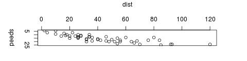
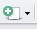

Nous allons reprendre le travail fait dans le [TP 1](info-dec-sante-tp1.html) pour créer un tableau de bord sur la base de données publiques des médicaments. Celui-ci pourra donc être mis à jour mensuellement.

Nous verrons donc comment on peut produire un document (`HTML`, `PDF` voire `Word`) incluant à la fois le texte et les commandes `R` pour produire les éléments pour appuyer les commentaires (importation de données, tableaux, graphiques, ...). Ce type de document peut être produit sous `R` avec [rmarkdown][]

[rmarkdown]: http://rmarkdown.rstudio.com/ "Site officiel de R markdown"

> ce document a été écrit en `R markdown`. Vous pouvez voir le fichier source [ici][sourceTP2]. Pour mieux comprendre le langage, il est préférable de regarder le fichier source et ce document qui est donc la traduction du source en HTML.

[sourceTP2]: info-dec-sante-tp2.Rmd "Fichier source du TP2"

## Librairies

`R` fonctionne sur le principe d'un moteur de base, avec des fonctionnalités limitées. Celles-ci peuvent être augmentées grâce à l'ajout de **librairies** (appelées aussi *packages*). Il en existe de nombreuses, disponibles sur le site du [**CRAN**][cran] (*Comprehensive R Archive Network*).

[cran]: https://cran.r-project.org/ "site du CRAN"

### Chemin(s) de recherche des librairies

La commande `.libPaths()` permet de lister les différents répertoires dans lesquels `R` va pouvoir chercher les librairies. Si nous voulons en installer de nouvelles, et pouvoir les réutiliser plus tard, il faut donc spécifier un répertoire dans lequel nous avons les droits d'écriture.

Premièrement, il vous faut créer un répertoire dans votre `"Z:/"` qui contiendra les librairies `R`, par exemple nommé `"Rlib"`, directement à la racine de votre `"Z:/"`. Une fois celui-ci créé, vous pouvez indiquez à `R` qu'il doit aussi prendre en compte ce répertoire pour la recherche de librairies. Pour cela, vous devez exécuter la commande `.libPaths("z:/Rlib")`. Afin de vérfier que le répertoire a bien été ajouté, vous pouvez de nouveau lister les dossiers connus de `R` avec `.libPaths()`. Normalement, votre répertoire (ici `"Z:/Rlib"`) doit être affiché en premier.

Voici donc les commandes à exécutées ici.

```{r, eval=FALSE}
.libPaths()
.libPaths("z:/Rlib")
.libPaths()
```

**Attention.** Cet ajout du répertoire `"Z:/Rlib"` aux chemins connus de `R`, via la commande `.libPaths()`, devra être effectué à chaque nouvelle session (i.e. à chaque fois que vous relancez RStudio donc).

### Installation d'une librairie

Une fois le répertoire ajouté, nous pouvons installer les librairies directement dans `R` avec la commande `install.packages()`, en y listant les librairies voulues. Nous allons utilsier ici la librairie `rmarkdown`. Vous devez donc executer la commande suivante.

```{r, eval=FALSE}
install.packages("rmarkdown")
```

Quand vous l'exécuterez, vous verrez qu'il doit aussi installer d'autres librairies, appelées ici dépendances. Tout ceci est géré automatiquement par `R` sans que nous ayons à connaître la liste de ces dépendances.

**Attention.** L'installation d'une librairie n'est à faire qu'une seule fois.

### Chargement d'une librairie

Une fois les librairies installées, il sera donc possible de les utiliser. Mais pour ceci, il faut tout d'abord les charger, à chaque session grâce à la fonction `library()`. Pour charger une librairie, il faudra donc exécuter un code de type :

```{r, eval=FALSE}
library(rmarkdown)
```

**Attention.** Le chargement d'une librairie via `library()` devra être effectuée à chaque nouvelle session, pour les librairies dont vous avez besoin.


## Fichiers `.RData`

Plutôt que de devoir importer plusieurs fois des données, il est possible d'utiliser le format de données `.RData`, qui permet de sauvegarder tout ou partie de l'environnement de travail. Pour cela, nous allons utiliser les fonctions `save()` et `save.image()`  pour sauvegarder, et la fonction `load()` pour charger les variables sauvegardées.

### Sauvegarde de variable(s)

En premier lieu, il est possible de sauvegarder uniquement une variable créée dans un fichier `.RData`. Ci-dessous, nous créons l'objet `a`, qui est une chaîne simple, puis nous la sauvegardons dans le fichier `a.RData`. Enfin, nous la supprimons (et l'affichons pour bien voir qu'elle n'existe plus).

```{r, error=TRUE}
a = "test de RData"
print(a)
save(a, file = "a.RData")
rm(a)
print(a)
```

L'intérêt est donc que la variable `a` est dans le fichier `.RData`, qu'il est possible de charger dans `R` comme suit.

```{r}
load("a.RData")
print(a)
```

```{r, include=FALSE}
file.remove("a.RData")
```

Pour sauvegarder plusieurs variables, il faut juste les lister dans la fonction `save()`.

```{r, error=TRUE}
b = "deuxième test de RData"
c = 123456789
save(b, c, file = "bc.RData")
rm(b, c)
print(b, c)
```

Et on les charge de la même façon.

```{r}
load("bc.RData")
print(b)
print(c)
```

```{r, include=FALSE}
file.remove("bc.RData")
```

### Sauvegarde de l'environnement

Quand on lance la fonction `ls()`, on liste l'ensemble des objets créés dans l'environnement de travail. La fonction `save.image()` va tous les sauvegarder dans un même fichier `.RData`.

```{r}
ls()
save.image("env.RData")
```

Ensuite, nous allons nettoyer l'environnement de travail, en supprimant tous les objets (1ère ligne ci-dessous). Ainsi, en listant les variables avec `ls()`, on s'aperçoit qu'il n'y a plus rien.

```{r}
rm(list = ls()) # Pour tout supprimer de l'environnement
ls()
```

Enfin, toujours avec la fonction `load()`, on charge les variables présentes dans le fichier, qu'on retrouve bien en faisant un `ls()`.

```{r}
load("env.RData")
ls()
```

```{r, include=FALSE}
file.remove("env.RData")
```


### Données utilisées

Nous allons donc utiliser pour la suite les données d'un *data-mart* contenues dans le fichier [`ca.RData`](../donnees/ca/ca.RData). Pour ce faire, nous allons utiliser la commande `load()`. Nous vérifions ensuite qu'on a bien toutes les données voulues (en ayant supprimé en premier les objets existants).

```{r}
rm(list = ls())
load("../donnees/ca/ca.RData")
ls()
```

## Langage `markdown`

L'idée d'un document de type `R markdown` est donc d'inclure les commentaires et les commandes permettant d'obtenir les différents résultats. La syntaxe pour l'écriture du document est le langage [markdown][]. Il a l'avantage d'être très simple à utiliser et à lire. Voici quelques éléments de base. Il a été fait pour ensuite être traduit en `HTML`.

[markdown]: https://daringfireball.net/projects/markdown/ "page officiel du langage markdown"

### Titres

Il y a deux façons d'écrire des titres. La première avec des `"#"` en début de ligne, pour produire des titres de niveau 1 (`<h1>`) à 6 (`<h6>`).

```
# Titre de niveau 1

## Titre de niveau 2

...

###### Titre de niveau 6
```

L'autre ne concerne que les titres de niveau 1 et 2.

```
Titre de niveau 1
=================

Titre de niveau 2
-----------------
```

### Paragraphes et divers

Les paragraphes s'écrivent simplement, sans notation particulière. Un passage à la ligne seule ne sera pas suffisant pour un changement de paragraphe, il est nécessaire de laisser (au moins) une ligne entre deux paragraphes.

Il est possible de mettre en avant des mots de deux façons :

- `**mot(s) important(s)**` : un ou plusieurs mots encadrés par des `**` (ou des `__`) seront transformés en balise `strong` (souvent **mis en gras**)
- `*mot(s) moins importants*` : idem que précédement mais avec `*` (ou `_`), transformés en balise `em` (souvent *mis en italique*)

Pour faire un lien vers une page ou une URL, il est possible d'utiliser plusieurs syntaxes :

- `<url>` : lien mis directement (par exemple <http://fxjollois.github.io>)
-  `[texte](lien "texte optionnel")` : lien mis sur un texte (par exemple [ma page web](http://fxjollois.github.io "bla bla quand souris sur lien"))
-  `[texte][label]` : lien mis sur un texte aussi, avec un pied de page ajouté plus tard avec `[label]: url "texte optionnel"` (par exemple [page perso][page])

[page]: http://fxjollois.github.io "texte qui s'affiche lorsque la souris est sur le lien"

Pour intégrer des images dans un document `markdown`, on utilise un formalisme similaire aux liens, avec un `!`avant :

- `` : le texte sert à contextualiser l'image 

	
- `![texte][label]` : on définit le label par la suite avec `[label]: lien "texte optionnel"`

	![re bla][img_rpubs]

[img_rpubs]: plot.jpg "re bla bla bla bla qui s'affiche lorsque la souris est sur l'image"

On peut aussi ajouter des lignes horizontales, pour découper le texte. Pour cela, il est nécessaire d'écrire une ligne avec

- soit au moins 3 caractères identiques (`"*"` ou `"-"`)
- soit 3 caractères identiques (toujours `"*"` ou `"-"`) séparés d'un espace.

Voici les quatre façons de faire donc, qui produiront le même résultat :

```
***
---
* * *
- - -
```

Et un exemple de séparation

---

On peut aussi créer des blocs de citations (équivalent à la balise `blockquote`), en commençant les lignes par `">"`.

> Voici un exemple de bloc de citation, permettant de mettre en avant des éléments importants.

### Listes

Il est possible de créer deux types de listes (non-ordonnées et ordonnées). Il faut noter cependant que les listes doivent être séparées des paragraphes par (au moins) une ligne au-dessus et en-dessous. De plus, pour les sous-listes, il faut mettre une tabulation (ou deux si sous-sous-liste, et ainsi de suite).

Il est bien évidemment totalement possible de mélanger les deux types de listes si besoin.

#### Non-ordonnées

Ce sont les plus simples à écrire. Les items commencent tous par le même caractère. Le caractère utilisé ici (`"-"`) peut être remplacé par `"*"` ou `"+"`.

- 1er élément
- 2ème élément
    - sous-élement A
    - sous-élément B
    - ...
- etc...

#### Ordonnées

Pour avoir une liste ordonnée, il est nécessaire de commencer la ligne par un chiffre suivi de `"."`. Par contre, le chiffre indiqué n'est pas pris en compte. Ce qui fait que la sous-liste ici produira bien `1`, `2` et `3`.

1. élément 1
2. élément 2
    1. sous-élément 1
    1. sous-élément 2
    1. sous-élément 3


### Tableaux

On peut définir un tableau directement, en précisant d'abord le nom des colonnes (séparés par `"|"`). Il faut ensuite faire une séparation via une ligne avec `"---"` (au moins) pour chaque colonne et toujours des séparations (`"|"`) entre les colonnes. Ensuite, les valeurs de chaque ligne doivent être toujours séparées par des `"|"`. 

Le style de chaque colonne (aligné à gauche - par défaut, aligné à droite ou centré) peut être indiqué dans la ligne de séparation entre les noms de colonnes et les valeurs, avec

- `---` (ou `:--`) : aligné à gauche
- `--:` : aligné à droite
- `:-:` : centré

Voici un exemple de tableau, dans lequel nous avons défini le style de chaque colonne

col 1 | col 2 | ... | col n
:--|:-:|---|--:
Ligne | complète | sur 4 | colonnes
Ligne | incomplète | à la fin
 | ligne | incomplète | au début


### Codes

L'intérêt de ce langage est aussi de pouvoir intégrer des éléments de code (soit des blocs complets, soit des éléments en ligne), permettant de présenter le travail fait.

#### Bloc de code

Pour créer un bloc de code, il faut soit le précéder et le suivre d'une ligne avec <code>&#96;&#96;&#96;</code>, soit le faire commencer par une indentation (une tabulation ou 4 espaces).

```
# premier code quelconque
d = read.table("d")
summary(d)
```

	# deuxième code quelconque
	dd = subset(d, var1 == valeur)
	summary(dd)


#### Code en ligne

Il est aussi possible d'écrire du code (par exemple un nom de fonction ou autre) dans une phrase, en encadrant ce code entre deux `` ` ``, ce qui donne par exemple `fonction()`.


## Document `R markdown`

Un document `R markdown` (généralement enregistré avec l'extension `.rmd` ou `.Rmd`) permet d'une part d'utiliser la syntaxe `markdown` pour écrire du texte, mais aussi d'inclure des commandes `R` directement dans le document. Ainsi, un seul document contient le code et le commentaire, ce qui est un atout non négligeable pour des rapports ou présentations devant être mises à jour ou refaits régulièrement.

Il est possible d'inclure les commandes `R` soit dans un bloc de code, appelé *chunk* dans **R Studio**, ou en ligne, appelé *inline chunk*.

Pour créer un document `R markdown` dans **R Studio**, vous pouvez cliquer sur l'icône ![bouton nouveau document RStudio][bout_Rstudio_plus], puis sur *R markdown...*. Vous devez voir apparaître une interface vous demandant de choisir entre un document, une présentation, une application *Shiny* ou de choisir un *template* prédéfini. Nous allons rester sur le *document* pour le moment. De plus, vous pouvez indiquer le titre et l'auteur, ainsi que choisir le format de sortie (HTML, PDF ou Word). Nous allons garder HTML pour le moment.

[bout_Rstudio_plus]: icon_Rstudio_plus.jpg "Bouton de création d'un nouveau document - R Studio"

### En-tête

Lors de la création d'un nouveau document `R markdown`, vous devez voir apparaître en début de document une partie d'en-tête, comme ci-dessous, au format `YAML`.

```
---
title: "Untitled"
author: "FX Jollois"
date: "17/10/2016"
output: html_document
---
```

Dans cette en-tête, nous pouvons donc définir le titre, éventuellement un sous-titre (avec `subtitle:`), le ou les auteurs, la date et des options de sortie. Pour le moment, nous allons garder la sortie au format HTML. Pour passer au format `PDF`, il faut écrire `pdf_document` dans `output` (ainsi qu'avoir $\LaTeX$ installé sur sa machine - ce qui n'est pas le cas à l'IUT). Pour créer un document de type Word, il faut choisir `word_document` pour `output`. 

Il y a d'autres possibilités de sortie, ainsi que la possibilité d'ajouter d'autres paramètres de sortie, que nous ne verrons pas ici.

### *Chunk*

Un *chunk* sera donc un bloc de commande `R` (ou autre langage possible) qui sera exécuté par **R Studio**. Pour cela, il faut indiquer sur la première ligne le langage utilisé. Pour `R`, voici donc un exemple simple

<pre><code>&#96;&#96;&#96;{r}
# code R
summary(iris)
&#96;&#96;&#96;</code></pre>

Dans le document sera donc intégré à la fois le code, ainsi que le résultat de son exécution. L'exemple donnera donc

```{r}
# code R
summary(iris)
```

Il est possible de nommer le *chunk* en lui donnant un label (sans espace, sans accent) après `r` dans les `{}`. Ceci est intéressant surtout dans l'étape de développement, car si une erreur arrive lors de l'exécution, il sera plus facile de retrouver dans quel *chunk* est l'erreur (indiqué lors de l'affichage de l'erreur).

De plus, il est possible de mettre des options dans le *chunk*, toujours dans les `{}`, après une `","`. Voici quelques options classiques et utiles (avec leur valeur par défaut indiquée, si elle existe) :

- `include = TRUE` : si `FALSE`, le code est exécuté mais il n'est pas inclus dans le document (ni le code, ni son résultat)
- `echo = TRUE` : si `FALSE`, le code n'est pas affiché mais bien exécuté
- `eval = TRUE` : si `FALSE`, le code est affiché mais n'est pas exécuté
- `results = 'markup'` : permet de définir comment le résultat est affiché (intéressant pour les tableaux, cf plus loin)
- `fig.cap` : titre du graphique produit

Il est possible de mettre plusieurs options, toutes séparées par des `","`.

#### Quelques exemples

Dans la suite, voici quelques exemples de *chunks* avec options. Regardez le source pour mieux comprendre le fonctionnement.

Tout d'abord, on importe les données `heart.txt`, mais ce genre de code n'est souvent pas à inclure, dans le sens où l'on ne veut ni l'afficher, ni voir de résultat.

```{r import, include = FALSE}
heart = read.table("../donnees/heart.txt", header = TRUE)
```

Ensuite, la librairie `knitr` contient une fonction `kable()` permettant d'afficher un `data.frame` au format `markdown`. Cela permet d'avoir un résultat plus lisible qu'une sortie de console `R` classique.

```{r head}
knitr::kable(head(heart))
```

Enfin, on peut vouloir faire un graphique, ce qui pourrait donner ce qui suit. Pour ce genre de présentation, nous pouvons décider de ne pas afficher le code permettant de les obtenir.

```{r graph, fig.cap = "Répartition du sexe des individus selon le problème cardiaque", echo = FALSE}
par(mar = c(5, 2, 2, 0) + .1)
couleurs = c("orange", "green")
barplot(prop.table(table(heart$sexe, heart$coeur), margin = 2) * 100,
        main = "Problème cardiaque en fonction du sexe",
        sub = "les hommes semblent plus touchés par\n un problème cardique que les femmes.", 
        cex.sub = .8, font.sub = 3,
        xlim = c(0, 3.5),
        col = couleurs)
legend("right", legend = levels(heart$sexe), fill = couleurs, bty = "n", text.width = .8, title = "Sexe")
```

### *Inline chunk* 

On peut faire des *chunks* en ligne en encadrant le code avec des `` ` `` et en commencant le code par un `r`. Par exemple, on peut dire que dans le jeu de données `heart` sont présentés `r nrow(heart)` individus et `r ncol(heart)` variables.

### Paramètres globaux des *chunks*

Il est possible de déterminer des paramètres globaux pour tous les blocs *chunks* du document (sauf paramètres locaux précisés). Ceci doit se faire comme suit, avec la fonction `set()` de l'objet `opts_chunk` de la librairie `knitr`. Il est par exemple possible de définir `echo=FALSE` pour n'avoir aucun code apparaissant dans le document.

```{r, eval=FALSE}
knitr::opts_chunk$set(...)
```

## Package `flexdashboard`

Nous allons maintenant voir comment utiliser la librairie [`flexdashboard`](http://rmarkdown.rstudio.com/flexdashboard) (basée entre autres sur `rmarkdown`) pour générer des tableaux de bords automatisés. Nous allons voir ici quelques éléments de base, vous trouverez beaucoup d'autres informations sur le site indiqué.

```{r setup, include=FALSE}
rm(list = ls())
knitr::opts_chunk$set(eval=FALSE)
```

### Installation

Vous devez d'abord installer le package via la commande `install.packages()`. Pour rappel, voici les étapes à suivre (non exécutées dans ce document).

```{r}
.libPaths("z:/Rlib")    # ou un autre chemin en fonction de vos choix précédents
install.packages("flexdashboard")
library(flexdashboard)
```

### Création d'un premier document

Une fois que vous avez chargé la librairie, il est possible de créer un document de base de type `flexdashboard` en suivant les étapes suivantes :

1. Cliquer la création d'un nouveau document ()
1. Choisir **R markdown...**
1. Choisir ensuite **From Template** et sélection **Flex Dashboard**

Vous devez obtenir un document commençant par 

```{r}
---
title: "Untitled"
output: 
  flexdashboard::flex_dashboard:
    orientation: columns
    vertical_layout: fill
---

...
```

En cliquant sur **Knit**, vous devez obtenir le [document suivant](etapes-reporting/etape-reporting-1.html). Vous remarquerez qu'il y a de la place pour mettre des graphiques et/ou des tableaux. Nous allons agrémenter ce tableau de bord à l'aide de graphiques et de pastilles d'informations.

#### Modification du titre

En premier lieu, il faut changer le titre du reporting, en mettant par exemple `"Evolution CA"`.

#### Importation de données

Nous allons commencer par importer les données dans ce tableau de bord, grâce au code ci-dessus. Ceci permettra donc de ne pas avoir d'étapes de chargement des fichiers texte et de jointures, pouvant prendre du temps et inutiles puisque les données n'évoluent pas en temps réel.

Vous devez donc introduire le code suivant dans le premier *chunk* (en dessous du chargement de la librairie `flexdashboard`), nommé `setup` et ayant l'option `include=FALSE`. Ceci permettra donc d'avoir les données à disposition, mais que le code ne s'affiche pas dans le document final.

```{r}
load("../donnees/ca/ca.RData")
```

#### Premier graphique

Pour le premier graphique (`Chart A`), nous allons représenter l'évolution du chiffre d'affaires sur la période 2003-2004, mois par mois. Dans la partie `### Chart A`, nous allons d'abord modifier le titre en `"Evolution mois par mois"`, par exemple (au lieu de `"Chart A"` donc). Ensuite, il faut mettre le code suivant dans le *chunk* correspondant.

```{r, fig.align="center"}
d = setNames(aggregate(ca / 1000000 ~ mois_no, ca_tout, sum), c("mois", "ca"))
par(mar = c(4, 4, 0, 0) + .1)
plot(ca ~ mois, d, type = "b",
     xlab = "Mois", ylab = "Chiffre d'affaires (M€)")
abline(h = mean(d$ca), lty = 3, col = "gray50")
```

Une fois que vous compilez votre document, vous devez obtenir la [page suivante](etapes-reporting/etape-reporting-2.html). 

#### Deuxième graphique

Dans la fenêtre en haut à gauche (`Chart B`), nous allons placer un tableau, indiquant le chiffre d'affaires pour 2003 et pour 2004, mois par mois. Pour cela, nous allons d'abord renommer le titre en `"Comparaison mois par mois (en k€)"`. Puis nous allons mettre le code suivant dans le *chunk* correspondant.

```{r}
d = aggregate(cbind(ca2003, ca2004, evolution) / 1000 ~ mois + mois_numero, 
              ca_evol, sum)
d = subset(d, select = -mois_numero)
names(d) = c("Mois", "2003", "2004", "Evolution")
knitr::kable(d, digits = 0)
```

Une fois exécuté, vous obtenez le [document suivant](etapes-reporting/etape-reporting-3.html). Il est possible de naviguer dans le tableau avec la souris pour voir les mois caché.

#### Troisième graphique

Nous allons utiliser ici ce qu'on pourrait appeler une *pastille*, avec la fonction `valueBox()` du package `flewdashboard`. Celle-ci prend en paramètre une valeur à afficher (numérique ou textuelle), une icône, et éventuellement une couleur. Elle affichera aussi le titre (de niveau 3, `###`) mis avant le *chunk* la contenant. 

Il faut tout d'abord remplacer le titre par `"Augmentation entre 2003 et 2004"`. Ensuite, on va placer le code suivant dans le *chunk*.

```{r}
d = aggregate(ca ~ annee, ca_tout, sum)
v = paste(round((d$ca[2] / d$ca[1] - 1) * 100, 2), "%")
valueBox(v, icon = "fa-arrow-circle-up", color = "green")
```

Vous devriez avoir cette [page](etapes-reporting/etape-reporting-4.html) une fois le document `Rmd` compilé.

#### Plusieurs onglets

Il est possible de créer un système d'onglet pour avoir plusieurs pages dans le reporting. Pour cela, vous devez d'abord créer un titre de niveau 1 (`#`) pour la première page (en la nommant par exemple `"Synthèse"`). Ce titre doit être placé avant la ligne `Column...`.

Vous devriez avoir [cette page](etapes-reporting/etape-reporting-5.html) comme résultat.

Créer un deuxième onglet, nommé `"Détail"`, dans lequel nous allons mettre deux tables : une pour les départements et une pour les provenances. Voici les codes des deux *chunks* pour créer ces tableaux.

```{r}
evol.dpt = aggregate(cbind(ca2003, ca2004, evolution) / 1000 ~ departement, 
                     ca_evol, sum)
names(evol.dpt) = c("Département", "2003", "2004", "Evolution")
knitr::kable(evol.dpt, digits = 0)
```

```{r}
evol.prov = aggregate(cbind(ca2003, ca2004, evolution) / 1000 ~ provenance, 
                      ca_evol, sum)
names(evol.prov) = c("Provenance", "2003", "2004", "Evolution")
knitr::kable(evol.prov, digits = 0)
```

Une fois compilé, vous devriez avoir le [tableau de bord](etapes-reporting/etape-reporting-6.html) suivant.

### Modification de l'orientation

Dans la première page, nous avions disposer les différents éléments par colonnes (un élément dans la première et deux dans la deuxième). Il est possible de modifier cela pour une page spécifique. Dans la deuxième, à la suite du titre et sur la même ligne, il est possible d'ajouter `{data-orientation=rows}`. 

Ainsi, le tableau devient [celui-ci](etapes-reporting/etape-reporting-7.html).

Nous allons maintenant utiliser une jauge, avec la fonction `gauge()` du package `flexdashboard`. Celle-ci prend au minimum en paramètre une valeur, un minimum et un maximum.

Et pour avoir des graphiques prenant toute la page en bas, il faut réaliser deux étapes :

- Insérer un titre de niveau 2 avant les deux *chunks* créés
- Insérer un nouveau titre de niveau 2 puis les *chunk* contenant le code pour les graphiques

##### Nombre de département en hausse
```{r}
gauge(sum(evol.dpt$Evolution > 0), 0, nrow(evol.dpt))
```

##### Département avec la plus grosse évolution
```{r}
valueBox(evol.dpt$Département[which.max(evol.dpt$Evolution)], icon = "fa-level-up")
```

##### Nombre de provenance en hausse
```{r}
gauge(sum(evol.prov$Evolution > 0), 0, nrow(evol.prov))
```

##### Provenance avec la plus grosse évolution
```{r}
valueBox(evol.prov$Provenance[which.max(evol.prov$Evolution)], icon = "fa-level-up")
```

Au final, nous obtenons donc le [tableau de bord](etapes-reporting/etape-reporting-8.html) suivant.


### Publication

Pour information, pour publier un tableau de bord ainsi créé, il faut juste placer le document `.Rmd`, ainsi que les données si besoin, sur un serveur dédié ayant l'application `shiny server` dessus. C'est une opération simple, mais que souvent seul le service informatique pourra effectué.

Vous pouvez voir un exemple avec [ce lien](http://193.51.82.116:3838/demo/prog-stat-r-tp7/).

## Exercice

Mettre dans un tableau de bord les différents tableaux obtenus dans le TP1


