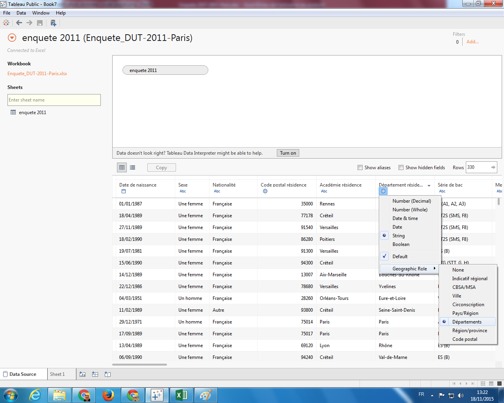
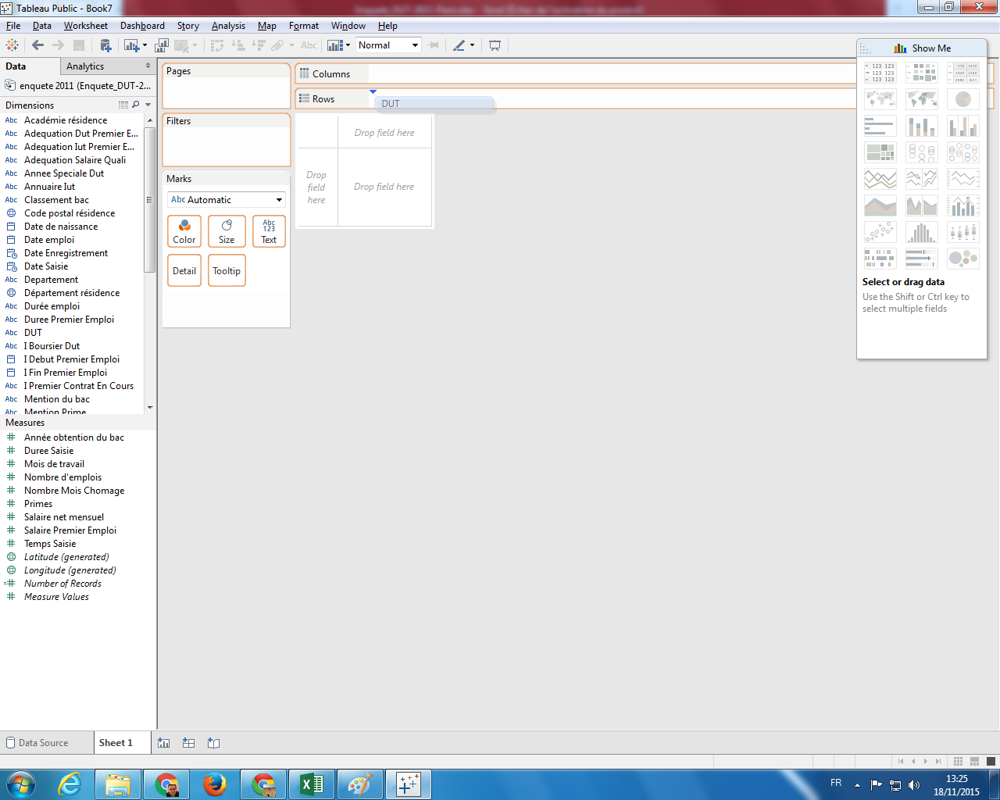
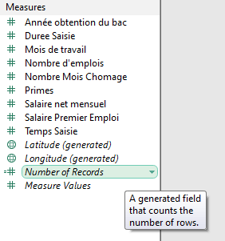
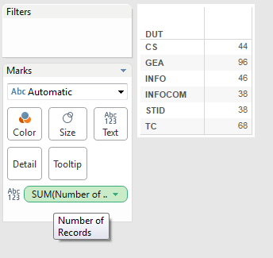
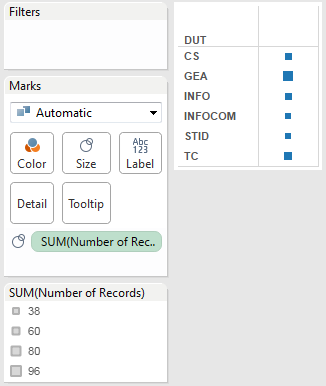
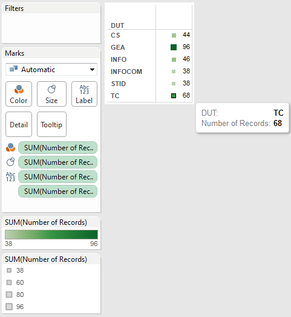
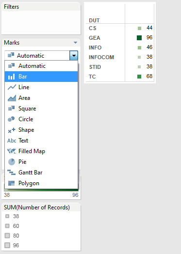
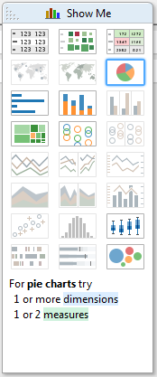
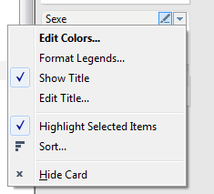
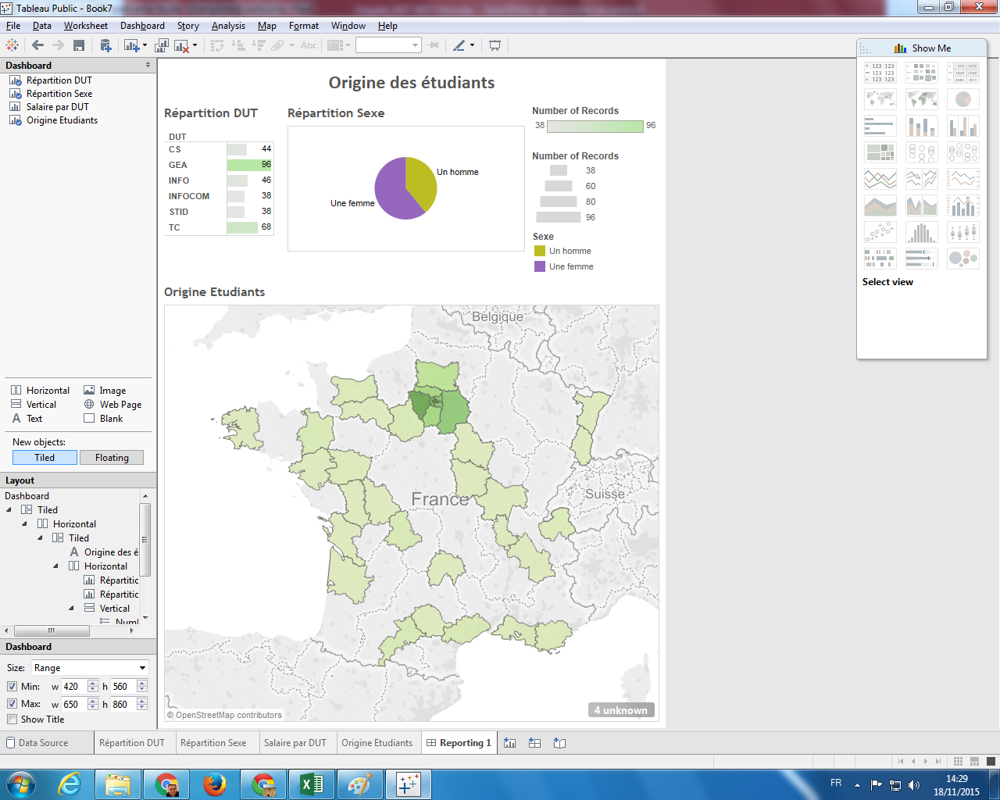

Vous trouverez le logiciel **Tableau Public** dans la liste des programmes, dans la
partie *Outils Math et Stat*. Vous devriez avoir l'écran suivant.

## Importation des données

Une fois le logiciel **Tableau Public** ouvert, vous devez vous connecter à des données 
pour commencer à travailler (ou ouvrir un projet précédemment créé). Nous allons utiliser 
ici les résultats de l'enquête national effectuée 2,5 ans après l'obtention du DUT auprès 
des étudiants diplômés en 2011 (cette enquête est faite tous les ans pour information). 
Nous n'avons à disposition que les étudiants de l'IUT Paris Descartes . Vous trouverez le 
fichier Excel [ici](reporting/tp1/Enquete_DUT-2011-Paris.xlsx).

Lorsque vous avez choisi votre fichier Excel, vous devriez voir apparaître l'écran suivant.

## Vérification des données

Une fois les données importées, on peut vérifier si les types associés sont les bons. Ici,
il n'y a aucun problème (a priori). 

Par contre, nous avons deux champs (`Code postal résidence` et `Département résidence`) qui peuvent avoir un rôle spécifique dans le logiciel. En 
effet, ce sont des indications géographiques et il est possible de leur définir un rôle géographique correspondant à leur définition (cf écrans suivants). 

Cela permettra de créer des cartes géographiques avec ajout d'informations statistiques.

### Code Postal

### Département

## Première feuille (ou *Sheet*)

La logique de *Tableau* est de créer d'abord les représentations (tableaux ou graphiques) que l'on désire dans des *Worksheet* (ou *Feuille*), puis de les assembler (avec du texte aussi) dans un *Dashboard* (ou *Tableau de Bord*) ou une *Story* (pas de traduction spécifique pour le moment).

On va d'abord créer une représentation de la distribution du diplôme de DUT dans les réponses. Voici les étapes à suivre pour créer une nouvelle feuille :

1. Tout d'abord, vous devez cliquer sur *Sheet 1* (ou aussi *Go To Worksheet*. Vous obtenez l'écran suivant : 

2. Le logiciel *Tableau* fonctionne essentiellement sur le *Drag&Drop* (ou *Glisser/Déplacer*). Vous devez sélectionner `DUT` dans la liste à gauche (dans les *Dimensions*) et le placer dans la cellule à côté de *Rows* : 

3. Ensuite, dans la partie *Measures* à gauche, sélectionner *# Number of Records*, puis placer le dans le tableau (où il doit y avoir les valeurs `Abc`) 

4. Vous devez obtenir le résultat suivant : la répartition des répondants selon leur DUT d'origine 

5. Pour avoir un rendu plus visuel, on peut aussi placer ce nombre d'enregistrements (ou de lignes) sur l'icône *Color* (en le prenant dans le module *Marks*), et obtenir cette représentation (une légende des couleurs est apparue entre-temps) : 

6. Idem, on le place maintenant sur *Size* pour voir apparaître des carrés de tailles proportionnelles aux valeurs (idem, une légende a été créée) : 

7. En le plaçant sur *Tooltip*, rien ne s'affiche dans le tableau, sauf quand on place le curseur de la souris sur une des cases. On voit apparaître la valeur (i.e. le nombre d'enregistrements ayant cette modalité) : 

8. En prenant plusieurs fois la mesure *# Number of Records* de la partie *Measures* à gauche, il est possible de combiner les représentations, et on obtient ceci : 

9. On peut aussi changer la façon de représenter les valeurs dans le tableau, en choississant par exemple *Bar* dans le module *Marks* : 

10. Le résultat final de toutes ces manipulations devraient aboutir à cette représentation finale : 

Il est possible de modifier le nom de la feuille (par défaut *Sheet1*) en double-cliquant sur son nom en bas du logiciel (un peu comme dans *Excel* par exemple). Appeler cette feuille *Répartition DUT*.

## Deuxième feuille

Nous allons maintenant nous intéresser à la répartition du sexe dans nos réponses, en suivant les instructions suivantes : 

1. Créer donc une nouvelle feuille. Pour créer une deuxième feuille, vous devez aller dans le menu *Worksheet* puis *New Worksheet*. 
2. Glisser la colonne *Sexe* dans *Rows* (ou sur le tableau vide).
3. Glisser *# Number of Records* dans *Text* ou dans le tableau vide aussi. Vous devriez avoir un tableau de répartition du sexe dans les répondants.
4. Dans le module *Show Me* (à droite de votre écran normalement), il est possible de choisir la représentation et donc de changer le type de graphique. Cliquer sur le diagramme circulaire : 

5. Il est possible de spécifier les couleurs pour chaque modalité. Pour cela, cliquer sur la petite flèche à droite de *Sexe* dans la légende, puis *Edit Colors*. On peut soit directement changer la couleur (en en sélectionnant une), soit changer la palette de couleurs de base. 

6. Prenez la colonne *Sexe* dans *Dimensions* et placer la sur *Label* pour voir apparaître les modalités.
7. Enfin, renommez la feuille en *Répartition Sexe*.

## Troisième feuille

On veut maintenant connaître le montant du salaire mensuel des répondants (colonne *Salaire Net Mensuel*), en fonction de leur diplôme, en réalisant les opérations suivantes :

1. Créer une nouvelle feuille.
2. Glisser *DUT* sur *Rows*.
3. Glisser *Salaire Net Mensuel* (dans *Measures*) sur  *Size* et changeant en diagramme en barre en changeant dans *Marks* pour mettre *Bar* (au lieu de *Automatic*).
4. Vous remarquerez que, par défaut, l'agrégat fait est une somme (*SUM*). On peut changer ceci en cliquant sur la petite flèche sur l'agrégat, puis sur *Measure (Sum)*, puis *Average* ou *Median* (ou autre) en fonction de ce qu'on veut avoir (ici, on va prendre la médiane). 

5. Renommer la feuille en *Salaire par DUT*

## Quatrième feuille

On désire maintenant connaître l'origine géographique des répondants, et particulièrement leur département de résidence (colonne *Département résidence*), avec les opérations suivantes :

1. Créer une nouvelle feuille.
2. Double-cliquer sur *Département résidence* dans *Dimensions*. Ceci se fait automatiquement car, dans l'importation des données, nous avons bien spécifier que cette variable avait un rôle géographique (et plus spécifiquement un nom de département français). On voit apparaître une carte avec des points au centre de chaque région.
3. Dans *Show Me*, on choisit la carte avec couleur (cf image suivante) : 

4. On a maintenant une carte avec la même couleur pour chaque département dont au moins un répondant vient. Pour spécifier la couleur en fonction d'une variable, vous pouvez glisser *# Number of Records* sur *Color*.
5. On peut agrémenter la carte en ajoutant *Salaire Net Mensuel* (en indiquant la médiane) et *# Number of Records* sur *Tooltip* pour voir ces informations lorsque on cliquera sur un département.
6. Renommer cette feuille en *Origine Etudiants*.

## Premier tableau de bord (ou *Dashboard*)

L'idée d'un tableau de bord (ou **dashboard** en anglais) est de regrouper plusieurs représentations concernant un sujet sur une même page, afin de synthétiser les résultats. Nous allons ici faire un tableau de bord sur l'**origine des étudiants** :

1. Aller dans le menu *Dashboard* puis *New Dashboard*.
2. Renommer le en *Reporting 1*
3. Glisser *Text* en haut (écrivez `"Origine des étudiants"`, et, en sélectionnant le texte, choississez la police d'écriture *Calibri*, une taille de 18, un style en gras, et un alignement centré).
4. Ensuite, pour assembler les éléments (*Sheets* ou autre : texte, image, page web, ...), il faut jouer sur les répartitions disponibles (*Horizontal* ou *Vertical*) et en bougeant les éléments.
5. En intégrant les feuilles *Répartition DUT*, *Répartition Sexe* et *Origine Etudiants*, et en jouant sur la position et la taille des éléments et des légendes, vous pouvez obtenir un tableau de bord comme celui-ci : 

## Sauvegarde de votre travail

Pour sauvegarder votre travail, vous devez avoir un compte (cf présentation). 

Une fois connecté, vous devez donner un nom à votre travail (par exemple *Reporting - TP1*). Il sera sauvegardé sur votre compte hébergé par **Tableau Public**. 

Ceci a pour effet que vous pourrez ouvrir votre travail sur n'importe quel autre ordinateur en pouvant le reprendre la où vous en êtes. Vous pourrez aussi partager votre tableau de bord via un lien disponible en bas de la fenêtre de votre navigateur qui vient de s'ouvrir. On peut le partager via [un lien](https://public.tableau.com/views/Reporting-TP1/Reporting1?:embed=y&:display_count=yes&:showTabs=y) ou en l'intégrant dans une page web :

<noscript></noscript><object class='tableauViz' width='654' height='742' style='display:none;'><param name='host_url' value='https%3A%2F%2Fpublic.tableau.com%2F' /> <param name='site_root' value='' /><param name='name' value='Reporting-TP1&#47;Reporting1' /><param name='tabs' value='no' /><param name='toolbar' value='yes' /><param name='static_image' value='https:&#47;&#47;public.tableau.com&#47;static&#47;images&#47;Re&#47;Reporting-TP1&#47;Reporting1&#47;1.png' /> <param name='animate_transition' value='yes' /><param name='display_static_image' value='yes' /><param name='display_spinner' value='yes' /><param name='display_overlay' value='yes' /><param name='display_count' value='yes' /><param name='showVizHome' value='no' /><param name='showTabs' value='y' /><param name='bootstrapWhenNotified' value='true' /></object>

## A FAIRE

Vous devez réaliser un tableau de bord sur le **devenir des étudiants** intégrant les éléments suivants en général et en fonction du DUT obtenu :

- *Salaire Net Mensuel* médian 
- *Type d'emploi* (`null` indique nue valeur manquante - en faisant un clic-droit sur cette modalité, il est possible de l'exclure)
- *Travail* 
- *Parcours Libellé* (on peut faire un tri manuel des modalités dans la partie des propriétés)

Voici une proposition de résultat :

<noscript></noscript><object class='tableauViz' width='1004' height='1136' style='display:none;'><param name='host_url' value='https%3A%2F%2Fpublic.tableau.com%2F' /> <param name='site_root' value='' /><param name='name' value='Reporting-TP1&#47;Reporting2' /><param name='tabs' value='no' /><param name='toolbar' value='yes' /><param name='static_image' value='https:&#47;&#47;public.tableau.com&#47;static&#47;images&#47;Re&#47;Reporting-TP1&#47;Reporting2&#47;1.png' /> <param name='animate_transition' value='yes' /><param name='display_static_image' value='yes' /><param name='display_spinner' value='yes' /><param name='display_overlay' value='yes' /><param name='display_count' value='yes' /><param name='showVizHome' value='no' /><param name='showTabs' value='y' /><param name='bootstrapWhenNotified' value='true' /></object>

