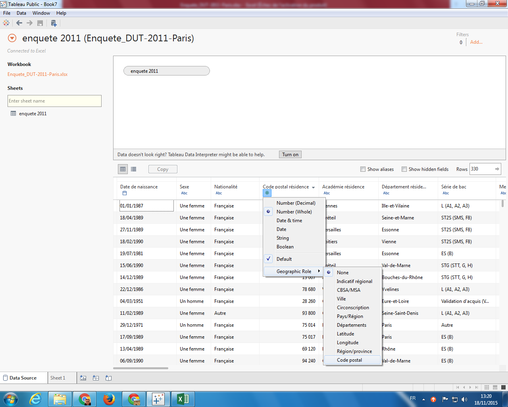

Vous trouverez le logiciel **Tableau Public** dans la liste des programmes, dans la
partie *Outils Math et Stat*. Vous devriez avoir l'écran suivant.

## Importation des données

Une fois le logiciel **Tableau Public** ouvert, vous devez vous connecter à des données 
pour commencer à travailler (ou ouvrir un projet précédemment créé). Nous allons utiliser 
ici les résultats de l'enquête national effectuée 2,5 ans après l'obtention du DUT auprès 
des étudiants diplômés en 2011 (cette enquête est faite tous les ans pour information). 
Nous n'avons à disposition que les étudiants de l'IUT Paris Descartes . Vous trouverez le 
fichier Excel [ici](reporting-tp1/Enquete_DUT-2011-Paris.xlsx).

Lorsque vous avez choisi votre fichier Excel, vous devriez voir apparaître l'écran suivant.

## Vérification des données

Une fois les données importées, on peut vérifier si les types associés sont les bons. Ici,
il n'y a aucun problème (a priori). Par contre, nous avons deux champs (`Code postal résidence` 
et `Département résidence`) qui peuvent avoir un rôle spécifique dans le logiciel. En 
effet, ce sont des indications géographiques et il est possible de leur définir un rôle
géographique correspondant à leur définition (cf écrans suivants). 

### Code Postal

### Département

## Première feuille (ou *Sheet*)

Voici les étapes à suivre pour créer une nouvelle feuille

03-premiere-feuille--choix-marks.png
03-premiere-feuille--glisser-DUT-lignes.png
03-premiere-feuille--glisser-number-color.png
03-premiere-feuille--glisser-number-combinaison.png
03-premiere-feuille--glisser-number-size.png
03-premiere-feuille--glisser-number-tooltip.png
03-premiere-feuille--marks-bar.png
03-premiere-feuille--number-of-records--bis.png
03-premiere-feuille--number-of-records.png
03-premiere-feuille--vide.png

## Deuxième feuille

04-deuxieme-feuille--diagramme-circulaire.png
04-deuxieme-feuille--edition-couleur-sexe.png

## Troisième feuille

05-troisieme-feuille--changement-agregat.png

## Quatrième feuille

06-quatrieme-feuille--changement-carte.png

## Premier tableau de bord (ou *Dashboard*)

07-tableau1-resultat.png

## Sauvegarde de votre travail

## A FAIRE
